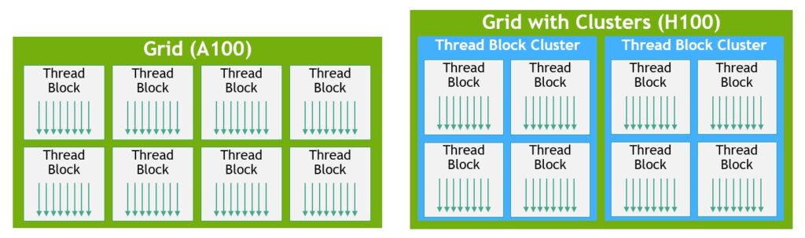
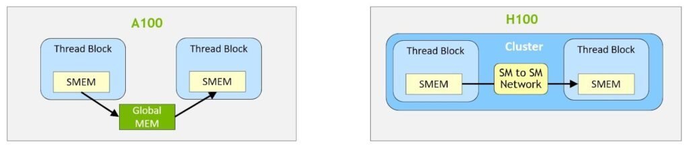
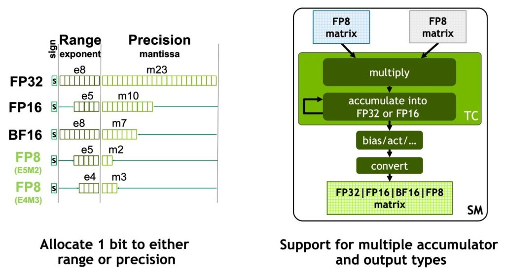
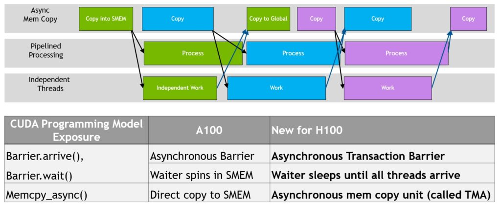
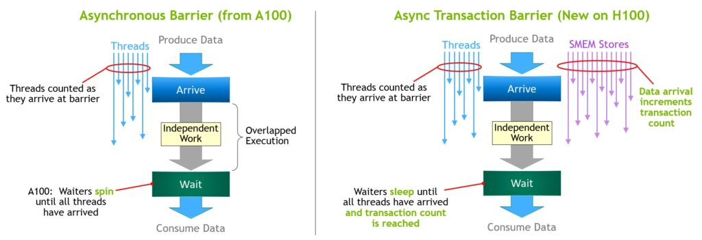

# Part 2 · Lecture 02 — Hopper Hardware Story: H100, H200, Transformer Engine v2, TMA, and WGMMA

## Overview

The **Hopper architecture** (Compute Capability 9.0) is the silicon every 2024–2026 production inference deployment runs on by default. Understanding what it provides — and what its successor (Blackwell) inherits and changes — is the **foundation of every Part 2 lecture**.

This lecture goes deep on every hardware feature that distinguishes Hopper from Ampere, covering:

1. The H100 SXM5 silicon — SM count, tensor cores, HBM3, NVLink 4, NVSwitch fabric.
2. **Thread Block Clusters** and **Distributed Shared Memory (DSM)** — the new inter-SM coordination primitive.
3. H200 — same silicon, more memory, faster memory.
4. **Transformer Engine v2** — the FP8 mixed-precision system, the scaling problem, scaling granularity, the amax history, the `DelayedScaling` and `MXFP8` recipes, and inference-mode static quantization.
5. **TMA (Tensor Memory Accelerator)** — the hardware async copy engine, tensor descriptors, `cp.async.bulk.tensor`, the mbarrier async transaction barrier, warp-specialization producer/consumer patterns, and multi-stage pipelines.
6. **WGMMA (Warp-Group Matrix Multiply Accumulate)** — Hopper's async tensor-core instruction, operand layout, swizzled shared memory, the commit/wait protocol, and how CUTLASS 3.x / CuTe wires it all together.
7. A complete Hopper kernel anatomy that puts TMA + WGMMA + FP8 + warp specialization together in one diagram.
8. CUDA / cuDNN / FlashAttention-3 — the software stack that exposes the silicon.
9. What this means for Llama 3.3 70B and Qwen 2.5 72B specifically.

By the end you should be able to explain not just *what* H100 features exist, but *exactly how they compose* at the PTX and CUDA C++ levels — and why TensorRT-LLM with FP8 + WGMMA + TMA unlocks close to 2× the throughput of a naive BF16 deployment on the same chip.

---

## 1. H100 SXM5 silicon — what's in the box


The H100 SXM5 is the first GPU built with GH100 silicon, fabricated at TSMC N4 (4nm-class). High-level numbers:

| Feature | H100 SXM5 |
|---|---|
| Architecture | Hopper (GH100), Compute Capability 9.0 |
| SMs | **132** (8 GPCs × ~16–17 SMs each) |
| FP32 CUDA cores | 128 per SM → **16,896 total** |
| FP64 CUDA cores | 64 per SM |
| Tensor cores | **4 per SM** (4th-generation) → **528 total** |
| BF16/FP16 peak | **989 TFLOP/s** |
| FP8 peak | **1,979 TFLOP/s** (exactly 2× BF16) |
| FP64 peak | **67 TFLOP/s** |
| HBM type | HBM3 |
| HBM capacity | **80 GB** (5 stacks × 16 GB) |
| HBM bandwidth | **3.35 TB/s** |
| L2 cache | **50 MB** on-chip |
| NVLink | 18 links × 50 GB/s = **900 GB/s** per GPU |
| NVSwitch v3 | fully-connected 8-GPU all-to-all, 900 GB/s simultaneous |
| PCIe | Gen5 × 16 = **128 GB/s** host ↔ GPU |
| TDP | **700 W** (SXM5) |
| Process | TSMC N4 (4nm-class) |

### 1.1 Per-SM internals (what every SM has)

This is where the Hopper-new features live:

```text
per SM (Hopper / GH100):
  ├─ 128 FP32 CUDA cores
  ├─ 64 FP64 cores
  ├─ 4 × 4th-gen Tensor Cores
  │     supports: FP8, FP16, BF16, TF32, FP64, INT8
  │     new in Hopper: native FP8 inputs (no software emulation)
  ├─ 256 KB register file
  ├─ 228 KB shared memory + L1 cache (configurable split)
  ├─ Tensor Memory Accelerator (TMA)   ← NEW in Hopper
  │     async hardware DMA engine, no compute registers consumed
  ├─ Warp-Group Matrix Multiply (WGMMA) support  ← NEW in Hopper
  │     4 warps cooperate on one async matmul instruction
  ├─ Distributed Shared Memory (DSM)   ← NEW in Hopper
  │     direct shared-memory access to any SM in the Thread Block Cluster
  └─ Asynchronous transaction barrier (mbarrier ext)  ← NEW in Hopper
        tracks both arrival count AND byte-transaction count
```

The four features marked NEW in Hopper — TMA, WGMMA, DSM, and the extended mbarrier — are the subject of §2 through §7 of this lecture. They are not incremental improvements; they enable a fundamentally different **async producer-consumer programming model** that is why Hopper kernels are so much faster than Ampere kernels for the same FLOP budget.

---

## 2. Thread Block Clusters — a new CUDA hierarchy



Every GPU programmer knows the three-level CUDA hierarchy: **Grid → Block → Thread**. Hopper adds a fourth level between Grid and Block: the **Cluster**.

```text
                  GRID
                   │
        ┌──────────┼──────────┐
        │          │          │
     CLUSTER    CLUSTER    CLUSTER        ← NEW in Hopper (CC 9.0)
        │
  ┌─────┴──────┐
  │   BLOCK    │ ← up to 8 Thread Blocks per Cluster (hardware limit)
  │  (SM 0)    │
  └────────────┘
  ┌────────────┐
  │   BLOCK    │ ← each Block maps to one SM; together they form a cluster
  │  (SM 1)    │
  └────────────┘
  ...
```

**Why it matters:** Thread Blocks within a Cluster are **co-scheduled** on neighboring SMs. They expose a shared resource — **Distributed Shared Memory** — and a new scope for synchronization and data exchange.

**CUDA C++ API:**

```cpp
// Declare cluster dimensions at compile time:
__cluster_dims__(2, 1, 1)  // cluster of 2×1×1 blocks, one block per SM
__global__ void my_kernel() {
    namespace cg = cooperative_groups;
    auto cluster = cg::this_cluster();
    uint32_t cluster_rank = cluster.block_rank();  // 0 or 1 within cluster
    uint32_t cluster_size = cluster.num_blocks();  // 2

    // Barrier across all blocks in the cluster:
    cluster.sync();
}

// Alternatively, set at launch time:
cudaLaunchConfig_t config = {};
cudaLaunchAttribute attrs[1];
attrs[0].id = cudaLaunchAttributeClusterDimension;
attrs[0].val.clusterDim = {2, 1, 1};
config.attrs = attrs;
config.numAttrs = 1;
cudaLaunchKernelEx(&config, my_kernel, ...);
```

**PTX cluster barrier:**

```ptx
// Arrive and wait at a cluster-level barrier:
barrier.cluster.arrive;       // signal arrival
barrier.cluster.wait;         // stall until all blocks arrive
```

**Key constraints:**
- Maximum **8 Thread Blocks per cluster** on GH100/H100 (hardware limit)
- All blocks in a cluster must be co-schedulable on adjacent SMs — the driver enforces this
- Cluster size must be a compile-time or launch-time constant
- Use `__cluster_dims__` for compile-time or `cudaLaunchAttributeClusterDimension` at runtime

**Where clusters appear in practice:** FlashAttention-3 uses clusters (2–4 SM clusters) to tile the KV sequence dimension across SMs while sharing partial softmax statistics via DSM. This allows FA3 to scale attention to very long contexts without HBM round-trips for the per-SM partials.

---

## 3. Distributed Shared Memory (DSM)



**Distributed Shared Memory** allows any SM in a Cluster to directly read and write any other SM's shared memory — no HBM round-trip required.

```text
   A100 (no DSM): SM 0 smem → HBM → SM 1 smem  (global mem round-trip)
   H100 (DSM):    SM 0 smem ──────→ SM 1 smem   (direct on-chip access)
```

### 3.1 How to access another SM's shared memory

```cpp
__global__ void dsm_example() {
    namespace cg = cooperative_groups;
    auto cluster = cg::this_cluster();

    __shared__ float smem[1024];

    // Get a pointer to ANOTHER block's smem (block rank 0's smem):
    float* remote_smem = reinterpret_cast<float*>(
        cluster.map_shared_rank(smem, 0)  // 0 = target block rank in cluster
    );

    // Populate local smem, sync, then read from another SM's smem:
    smem[threadIdx.x] = compute_local_partial();
    cluster.sync();  // wait until all SMs have filled their smem

    float neighbour_val = remote_smem[threadIdx.x];  // direct SM-to-SM read
}
```

**Bandwidth:** SM-to-SM DSM transfers run at **~130 GB/s per link** on H100 (far lower than HBM's 3.35 TB/s aggregate, but the latency is roughly 20× lower than a full HBM round-trip, and DSM exchanges avoid polluting the HBM queue entirely).

### 3.2 TMA and DSM: loading into another SM's shared memory

A key Hopper capability: TMA can issue a load that targets **a different SM's shared memory** (not just the local SM). This is used in FA3 to have one SM prefetch KV tiles directly into a neighbor's smem while the neighbor is computing:

```ptx
// cp.async.bulk.tensor with shared::cluster target:
// this loads from global memory into the shared memory of any SM in the cluster
cp.async.bulk.tensor.2d.shared::cluster.global.mbarrier::complete_tx::bytes
    [remote_smem_addr],               // smem of a DIFFERENT SM in the cluster
    [tma_desc, {coord_y, coord_x}],
    [mbar_addr],
    txBytes;
```

The `shared::cluster` scope is what makes this different from a normal TMA load (which uses `shared::cta` for current-SM-only). This is a hardware-level operation with no CPU involvement — the TMA engine handles the routing.

---

## 4. H200 — same compute, better memory

H200 is the **same GH100 die** — same SM count, same FLOPs ceiling, same NVLink, same NVSwitch. The differences are all in the memory system:

| Spec | H100 SXM5 | H200 SXM5 | Δ |
|------|-----------|-----------|---|
| HBM type | HBM3 | **HBM3e** | newer generation |
| HBM capacity | 80 GB | **141 GB** | +76% |
| HBM bandwidth | 3.35 TB/s | **4.80 TB/s** | **+43%** |
| Compute (BF16) | 989 TFLOP/s | 989 TFLOP/s | — |
| Compute (FP8) | 1,979 TFLOP/s | 1,979 TFLOP/s | — |
| NVLink | 900 GB/s | 900 GB/s | — |
| TDP | 700 W | 700 W | — |

For our two Part 2 models:

| Model | FP16 size | FP8 size | H100 single-GPU | H200 single-GPU |
|-------|-----------|----------|-----------------|-----------------|
| Llama 3.3 70B | ~140 GB | ~70 GB | ❌ FP16 doesn't fit | ✓ FP16 just fits (tight); ✓ FP8 comfortable |
| Qwen 2.5 72B | ~144 GB | ~72 GB | ❌ FP16 too large | ✓ FP8 comfortable |

**The H200's main inference impacts:**

1. **Single-GPU 70B-class serving at FP8** is the practical sweet spot: ~70 GB for weights leaves ~70 GB for KV cache and activations.
2. **Decode TPOT improves ~30–43%** on bandwidth-bound workloads: the bandwidth-ceiling equation (`tokens/s ≤ HBM_BW / bytes_per_token`) directly tracks the 43% BW improvement at batch=1 decode.
3. **Long-context serving (128K tokens)** becomes viable without aggressive KV quantization, because there is 60+ GB of headroom after FP8 weights.
4. **Prefill throughput does not improve** on H200 (prefill is compute-bound; same FLOPs = same throughput ceiling).

H100 remains the training and batch-processing workhorse. **H200 is the workhorse for chat / decode-dominant inference.**

---

## 5. Transformer Engine v2 — FP8 Mixed Precision

The single most important Hopper software feature for inference. Transformer Engine (TE) is NVIDIA's mixed-precision library that uses **FP8 tensor cores** while maintaining BF16/FP32-quality output.

### 5.1 The two FP8 formats — anatomy



FP8 is not one format — it is two, with different precision/range tradeoffs:

| Field | E4M3 | E5M2 |
|-------|------|------|
| Sign bits | 1 | 1 |
| Exponent bits | **4** | **5** |
| Mantissa bits | **3** | **2** |
| Max representable | **±448** | **±57,344** |
| Min normal | 2⁻⁶ ≈ 0.0156 | 2⁻¹⁴ |
| Precision | higher (3-bit mantissa) | lower (2-bit mantissa) |
| Dynamic range | lower | **higher** |
| Used for | **weights + forward activations** | **backward gradients + KV cache** |
| Total patterns | 256 (including NaN) | 256 |

**Why two formats?** Model weights and forward activations have small, bounded values — they benefit from E4M3's higher mantissa precision. Backward gradients can spike to large values during training — they need E5M2's wider dynamic range to avoid overflow. For inference-only deployments: E4M3 everywhere (no gradients).

**Special values — important difference from FP16:**

```text
E4M3: NO ±Inf.  All-exponent-ones + mantissa=111 → NaN (0x7F, 0xFF only).
                Overflow saturates to ±448 rather than going to Inf.
                This is intentional: saturation is safer than Inf propagation in training.

E5M2: HAS ±Inf. 0x7C = +Inf, 0xFC = -Inf.
                NaN = 0x7F (positive) or 0xFF (negative).
```

The absence of Inf in E4M3 means it cannot represent layer-norm pre-activations that momentarily spike > 448 without saturation error — which is why per-tensor scaling must be tight enough to prevent this.

### 5.2 Why FP8 needs explicit scaling — the quantization equation

FP8 numbers span a range of ≈ ±448 (E4M3). Real tensors in a transformer can have values in any range from ~1e-6 (small weights after training) to ~1e3 (attention logits before softmax). Without a **scale factor**, most tensors would either overflow (become ±448) or underflow (become 0), destroying precision.

The solution: each tensor gets a per-tensor (or per-block) **scale factor** `s`:

```text
quantize:   fp8_val = round_to_fp8( real_val × s )
dequantize: real_val ≈ fp8_val / s

scale choice: s = max_fp8_repr / amax(tensor)
              s = 448 / amax(tensor)   [for E4M3]

This maps the tensor's maximum absolute value to ±448.
Elements below 448/256 ≈ 1.75 map to the smallest representable E4M3 value.
Elements exactly at amax(tensor) map to ±448.
```

The quantization error is bounded by:

```text
|error| ≤ (1/2) × (amax / 448) × 2^(1 - mantissa_bits)
         = (1/2) × amax × 2^(1-3) / 448
         = amax × (1/8) / 448
         ≈ amax × 0.00028
```

So for a typical weight with amax = 1.0, the worst-case rounding error per element is ~0.00028, well within the tolerance for neural network inference.

### 5.3 Scaling granularity: per-tensor vs per-channel vs per-block (MXFP8)

| Granularity | One scale per | Accuracy | Overhead | Used in |
|-------------|---------------|----------|----------|---------|
| **Per-tensor** | entire tensor | lower | lowest | TE `DelayedScaling` default |
| **Per-channel** (per-row) | each output row of weight | medium | medium | W4A8, some FP8 recipes |
| **Per-block / MXFP8** | block of 32 elements (E8M0 scale) | **highest** | medium | TE v2 `MXFP8`, Blackwell native |

**Per-tensor** is the default and simplest: one float per tensor. Easy to fuse into the GEMM epilogue: the epilogue divides by `scale_A × scale_B` once to dequantize, then multiplies by `scale_C` to requantize the output for the next layer.

**Per-block (MXFP8)** aligns with the [OCP MXFP8 microscaling standard](https://www.opencompute.org/documents/ocp-microscaling-formats-mx-v1-0-spec-final-pdf). Each group of 32 consecutive elements in the same row shares one scale stored as E8M0 (8-bit exponent, 0 mantissa = a pure power of 2). The hardware can apply 32 different scales per matmul row, capturing intra-row magnitude variation that per-tensor scaling misses. This is how H100 approximates Blackwell's native MXFP8 mode and achieves < 0.1% accuracy drop vs BF16 on most benchmarks.

### 5.4 The amax history — how scaling adapts during training

For training, the optimal scale changes each step (gradient magnitudes shift as learning progresses). TE tracks a **history of amax values** to compute a stable scale:

```text
DelayedScaling recipe — default TE behavior:
  step t:
    ① during forward:
         use scale[t] (computed from previous steps' amax history)
         compute the matmul in FP8
         record amax_t = max(abs(output_tensor))  [scanned during the GEMM epilogue]
    ② after forward:
         amax_history[(t) % history_len] = amax_t
         scale[t+1] = 448 / max(amax_history)    [max over history window]

advantage: only one forward pass per step (no look-ahead required)
risk: if amax spikes suddenly in step t, scale[t] is stale → one step of saturation
      → self-corrects in step t+1 (amax history now includes the spike)
margin parameter: scale[t+1] = 448 / (max_amax × 2^margin)
                  → keeps scale below the theoretical max for safety headroom
```

```python
import transformer_engine.pytorch as te
from transformer_engine.common.recipe import DelayedScaling, Format

fp8_recipe_train = DelayedScaling(
    margin=0,                     # 0 = no extra headroom; +1 halves the scale
    interval=1,                   # recompute scale every N steps
    fp8_format=Format.HYBRID,     # E4M3 forward, E5M2 backward
    amax_history_len=16,          # track 16 steps of amax
    amax_compute_algo="max",      # use max of history (conservative)
    override_linear_precision=(False, False, False),
)
```

For **inference** (no backward pass, scales are calibrated offline):

```python
fp8_recipe_infer = DelayedScaling(
    fp8_format=Format.E4M3,   # inference: only forward, E4M3 everywhere
    amax_history_len=1,        # no rolling history; use static calibration amax
    margin=0,
)
# Before inference, run calibration:
with te.fp8_autocast(enabled=True, fp8_recipe=fp8_recipe_infer, calibrating=True):
    for batch in calibration_batches:
        model(batch)  # populates amax history from actual data
# After calibration, amax_history has the real distribution → scale is accurate
```

### 5.5 TE v2 MXFP8 recipe

Transformer Engine v2 adds native MXFP8 (per-block) support, enabling the finer-grained scaling that approaches Blackwell's hardware behavior on H100:

```python
from transformer_engine.common.recipe import MXFP8, Format

fp8_recipe_mx = MXFP8(
    fp8_format=Format.E4M3,    # E4M3 per block (32-element groups)
)

# Use exactly like DelayedScaling:
with te.fp8_autocast(enabled=True, fp8_recipe=fp8_recipe_mx):
    y = model(x)
```

MXFP8 achieves near-BF16 accuracy on most models by eliminating the single-scale bottleneck for tensors with large intra-row value variation (common in attention Q/K matrices and gate activations).

### 5.6 The FP8 GEMM hardware path

On H100, a 4th-generation tensor core executes:

```text
D[m,n] = Σ_k A[m,k] × B[k,n]
  A in E4M3 or E5M2 (from registers / shared memory)
  B in E4M3 or E5M2 (from registers / shared memory)
  accumulate in FP32 (the tensor core accumulator is always FP32 for FP8 inputs)
  D output cast to FP16 / BF16 / FP32 / FP8 in the epilogue

throughput: 1,979 TFLOP/s at FP8    (exactly 2× the 989 BF16 peak)
```

The hardware computes FP8 multiply in the tensor core and accumulates into a 32-bit accumulator. Scale dequantization happens in the **epilogue kernel** (the code that runs after the matmul), not inside the tensor core itself:

```text
GEMM epilogue sequence (per output tile):
  ① D_fp32 = matmul(A_fp8, B_fp8)              [in tensor core, FP32 accum]
  ② D_dequant = D_fp32 / (scale_A × scale_B)   [dequantize in epilogue]
  ③ D_bias = D_dequant + bias                  [optional bias add]
  ④ D_act = activation(D_bias)                  [GELU/SiLU, optional]
  ⑤ D_out = round_to_fp8(D_act × scale_out)    [requantize for next layer]
  ⑥ store D_out to HBM                          [one write: FP8 or BF16]
```

The epilogue is fused into the same kernel as the matmul — no separate pass over HBM for each step. TE and CUTLASS handle this fusion automatically.

**Memory bandwidth impact:** FP8 weights are 1 byte/param vs BF16's 2 bytes/param. For decode (bandwidth-bound):

```text
batch-1 decode memory traffic for 70B model:
  BF16 weights: 70B × 2 bytes = 140 GB per token step
  FP8 weights:  70B × 1 byte  = 70 GB per token step
  → FP8 halves bandwidth pressure → up to 2× more tokens/s at batch 1

batch-1 decode throughput ceiling:
  H100 BF16: 3.35 TB/s ÷ 140 GB ≈ 23.9 tok/s
  H100 FP8:  3.35 TB/s ÷  70 GB ≈ 47.8 tok/s   (+2×)
  H200 FP8:  4.80 TB/s ÷  70 GB ≈ 68.6 tok/s   (+2.87× vs H100 BF16)
```

### 5.7 Transformer Engine v2 Python API

TE provides drop-in replacements for PyTorch modules. The replacement uses the same interface but routes through FP8 tensor cores:

```python
import torch
import transformer_engine.pytorch as te
from transformer_engine.common.recipe import DelayedScaling, Format, MXFP8

# ── Layer definitions ──────────────────────────────────────────────────────────
# te.Linear is a drop-in for torch.nn.Linear
linear = te.Linear(in_features=8192, out_features=8192, bias=False)

# te.LayerNormLinear fuses LayerNorm + Linear in one FP8 kernel:
ln_linear = te.LayerNormLinear(in_features=8192, out_features=8192, eps=1e-5)

# te.LayerNormMLP fuses LayerNorm + gate_proj + silu + up_proj + down_proj:
mlp = te.LayerNormMLP(
    hidden_size=8192,
    ffn_hidden_size=28672,     # Llama 3.3 70B intermediate size
    activation="swiglu",
)

# te.MultiheadAttention uses FA3 internally on Hopper:
attn = te.MultiheadAttention(
    hidden_size=8192,
    num_attention_heads=64,
    kv_channels=128,
)

# ── Forward pass ──────────────────────────────────────────────────────────────
x = torch.randn(16, 2048, 8192, device="cuda", dtype=torch.bfloat16)

fp8_recipe = DelayedScaling(fp8_format=Format.E4M3, amax_history_len=1)
with te.fp8_autocast(enabled=True, fp8_recipe=fp8_recipe):
    y = mlp(x)   # internally: LayerNorm(BF16) → gate/up proj (FP8) → SiLU → down proj (FP8)
```

**What `fp8_autocast` does step-by-step:**
1. Before each FP8 layer's forward, it quantizes the input tensor to FP8 using the stored scale.
2. Dispatches to a Hopper-native kernel: `cp.async.bulk.tensor` (TMA) for tile loads + `wgmma.mma_async` (WGMMA) for FP8 matmul.
3. After the matmul, dequantizes the output back to BF16 for the next layer (or keeps FP8 for a chained FP8 layer).
4. During the epilogue, scans the output for `amax` and updates the amax history for the next step.

### 5.8 TE layer types and fusion count

Transformer Engine aggressively fuses operations that would otherwise be separate kernel launches, each of which requires a round-trip through HBM:

| TE layer | Ops fused | Kernel launches | vs unfused |
|----------|-----------|-----------------|------------|
| `te.Linear` | GEMM | 1 | 1 |
| `te.LayerNormLinear` | LayerNorm + GEMM | 1 | 2 |
| `te.LayerNormMLP` | LayerNorm + gate GEMM + SiLU + up GEMM + down GEMM | 2–3 | 5 |
| `te.MultiheadAttention` | QKV proj + FA3 + out proj | 3 | 6+ |
| `te.TransformerLayer` | Self-attn block + MLP block + residuals | 5–6 | 12+ |

The fusion saves roughly 1 HBM round-trip per eliminated boundary. At 3.35 TB/s and intermediate tensors of ~300 MB per pass (16 × 2048 × 8192 × 2 bytes), each saved round-trip is worth ~90 µs — non-trivial at typical TPOT targets of 10–30 ms.

### 5.9 TE in production runtimes

| Runtime | FP8 support | Notes |
|---------|-------------|-------|
| **TensorRT-LLM** | Full, earliest, most mature | Uses TE C++ bindings. Best throughput, best parity. |
| **vLLM 0.22+** | FP8 weights + activations | Via Marlin kernels + TE integration. Close to TRT-LLM. |
| **SGLang 0.5+** | FP8 partial (MoE-focused) | Catching up on dense; strong on MoE. |
| **llama.cpp** | INT8 / INT4 (not FP8 TE) | Not Transformer Engine. Different quantization path. |

---

## 6. The Hopper Asynchronous Execution Model



Ampere introduced limited async operations (`cp.async` for tile loads). Hopper generalizes the model into a full **async producer-consumer architecture** with three async mechanisms that can overlap with each other:

```text
   COMPUTE (CUDA cores / Tensor Cores)
     ├─ wgmma.mma_async         ← async GEMM, NEW in Hopper (warp-group scope)
     └─ regular FP32/INT ops

   MEMORY TRANSFERS (HBM ↔ shared memory)
     ├─ cp.async.bulk.tensor    ← TMA, NEW in Hopper (dedicated HW engine)
     └─ cp.async                ← Ampere-era tile copy (still works, no TMA HW)

   SYNCHRONIZATION
     └─ mbarrier                ← async transaction barrier, EXTENDED in Hopper
```

In Ampere, compute and memory copies could overlap via `cp.async`, but each warp had to issue its own load instructions, consuming warp-slots for memory management. In Hopper:

- A **single thread** issues a full-tile TMA load (freeing 127 other threads to compute)
- A **warp-group** (128 threads) issues an async WGMMA matmul (freeing all threads to issue the next TMA load)
- The **mbarrier** provides the handshake so neither side races the other

The result is a true **software pipeline**:
- **Producer warps** fill shared memory buffers using TMA (async)
- **Consumer warps** drain those buffers using WGMMA (async)
- Both operate simultaneously, hiding HBM latency behind compute

This is the fundamental reason Hopper-native kernels achieve 85–95% of peak throughput, vs 60–70% for Ampere-era kernels with `cp.async`.

---

## 7. TMA — Tensor Memory Accelerator (deep dive)

TMA is a **dedicated hardware async DMA engine** built into each SM. It copies arbitrary multi-dimensional tiles from global memory (HBM) to shared memory — or vice versa — without consuming any of the SM's compute resources (no CUDA cores, no warp scheduler slots).

### 7.1 What TMA replaces

**Pre-Hopper (Ampere):** loading a matmul tile required all threads in the block to cooperate:

```ptx
// Ampere: 128 threads each load elements to fill one 64×16 tile
// Each thread issues its own cp.async:
cp.async.ca.shared.global [smem_addr + local_offset], [gmem_addr + local_offset], 16;
// then commit and wait for all async copies in the block:
cp.async.commit_group;
cp.async.wait_group 0;  // wait for ALL outstanding copies
```

**Problems:**
1. 128 thread-instructions just to orchestrate the copy — instruction bandwidth wasted.
2. `cp.async.wait_group 0` is **block-wide**: cannot express "wait only for this specific tile's bytes."
3. No way to wait for a subset of in-flight copies without either over-waiting (lower pipelining) or using complex manual tracking.

**Hopper TMA:** one instruction from one thread:

```ptx
// Hopper: thread 0 alone issues this; threads 1–127 are free to compute
cp.async.bulk.tensor.2d.shared::cluster.global.mbarrier::complete_tx::bytes
    [smem_dst],
    [tma_desc, {tile_y, tile_x}],
    [mbar_ptr],
    txBytes;
```

The SM's TMA hardware engine picks up this request and handles the HBM→smem transfer asynchronously. Thread 0 continues immediately — no stall.

### 7.2 Tensor descriptors — CUtensorMap

A **tensor descriptor** (type `CUtensorMap`) is an opaque 128-byte hardware object that tells the TMA engine everything about the tensor: its HBM address, shape, strides, tile (box) dimensions, element dtype, and swizzle pattern for shared memory layout. It is created on the **host CPU** before the kernel launch.

```cpp
// Host-side CUtensorMap creation:
CUtensorMap tma_map_A;

// For a 2D K-major matrix A of shape [rows × cols] in BF16:
cuTensorMapEncodeTiled(
    &tma_map_A,
    CU_TENSOR_MAP_DATA_TYPE_BFLOAT16,   // element dtype
    2,                                   // tensor rank (2D)
    gmem_base_ptr,                       // base address in GPU global memory
    (cuuint64_t[]){rows, cols},          // global tensor shape [dim0=rows, dim1=cols]
    (cuuint32_t[]){TILE_ROWS, TILE_COLS},// box (tile) shape per TMA call
    (cuuint64_t[]){cols, 1},             // strides in elements (row-major: stride0=cols, stride1=1)
    CU_TENSOR_MAP_INTERLEAVE_NONE,       // no sparse interleave
    CU_TENSOR_MAP_SWIZZLE_128B,          // 128-byte swizzle for bank-conflict-free smem layout
    CU_TENSOR_MAP_L2_PROMOTION_L2_128B,  // L2 prefetch hint
    CU_TENSOR_MAP_FLOAT_OOB_FILL_NONE    // out-of-bounds elements: leave zeros
);

// Pass to kernel as a constant parameter:
__global__ void gemm_kernel(
    const __grid_constant__ CUtensorMap tma_A,   // __grid_constant__: shared across CTA cluster
    const __grid_constant__ CUtensorMap tma_B,
    float* C_gmem, int M, int N, int K) { ... }
```

**Key descriptor fields:**

| Field | What it controls |
|-------|------------------|
| `global shape` | full tensor dimensions [D0, D1, ...], up to 5D |
| `box shape` | tile size per TMA call — bytes transferred = prod(box_shape) × elem_size |
| `strides` | step in elements along each dimension (handles non-contiguous tensors) |
| `swizzle` | `NONE`, `32B`, `64B`, `128B` — how rows are permuted in smem (critical for bank conflicts) |
| `interleave` | `NONE` for dense; `INTERLEAVE_16B/32B` for sparse/strided formats |
| `OOB fill` | `NONE` (undefined), `ZEROS` (zero-fill out-of-bounds), `NAN_REQUEST_ZERO` |
| `L2 promotion` | prefetch hint to L2 cache |

**Swizzle modes in detail:**

```text
CU_TENSOR_MAP_SWIZZLE_128B:
  Permutes rows in shared memory by XOR-ing the row index into the column address.
  For a 128-element BF16 row (256 bytes), each row is stored in a different set
  of 128-byte aligned segments, preventing all threads from hitting the same bank.

  smem_offset(row, col) = row × stride + col XOR (row × 8)  [simplified view]
                                                    ↑
                           the XOR rotation spreads rows across 32 banks

Why you must match descriptor swizzle with CuTe layout:
  The TMA engine writes data in the swizzled layout.
  The WGMMA instruction reads data in the same layout (it knows the swizzle from its operand descriptor).
  If descriptor says 128B swizzle but CuTe layout says 64B → WGMMA reads wrong elements → silent corruption.
```

### 7.3 The TMA copy instruction — full anatomy

```ptx
cp.async.bulk.tensor.{1,2,3,4,5}d.{shared::cta | shared::cluster}.global
    .mbarrier::complete_tx::bytes
    [smem_addr], [tma_desc, {coord_0, ..., coord_N}], [mbar_ptr], txBytes;
```

| Token | Meaning |
|-------|---------|
| `cp.async.bulk` | bulk async copy (multi-byte, one-instruction, hardware-scheduled) |
| `tensor.2d` | 2D tensor mode: coords are tile indices [tile_row, tile_col], not byte offsets |
| `shared::cta` | write to this SM's shared memory |
| `shared::cluster` | write to any SM's shared memory in the cluster (via DSM) |
| `global` | read from global (HBM) memory |
| `mbarrier::complete_tx::bytes` | on completion, signal the mbarrier by delivering `txBytes` to the transaction count |
| `[smem_addr]` | shared memory destination (must be 16-byte aligned) |
| `[tma_desc, {...}]` | the descriptor + tile coordinates (each coord is a **tile index**, not a byte) |
| `[mbar_ptr]` | pointer to the `uint64_t` mbarrier in shared memory |
| `txBytes` | number of bytes to add to the mbarrier's expected-transaction counter (= box volume × elem_size) |

**Tile coordinate semantics:** `{coord_y, coord_x}` specifies which tile, not which byte. TMA computes:

```text
gmem_src_addr = base + coord_y × box_dim_y × stride_y + coord_x × box_dim_x × stride_x
```
So the inner K-loop becomes:

```cpp
for (int k = 0; k < K / TILE_K; k++) {
    int tile_k = k;              // tile index, not byte offset
    int phase  = k % 2;
    // Producer issues TMA for next tile:
    cp_async_bulk_tensor_2d(smem_A[phase], &tma_A, tile_m, tile_k, mbar[phase], TILE_BYTES_A);
    cp_async_bulk_tensor_2d(smem_B[phase], &tma_B, tile_k, tile_n, mbar[phase], TILE_BYTES_B);
}
```

### 7.4 The async transaction barrier (mbarrier) — deep dive



The **mbarrier** is how the consumer (WGMMA) side knows the TMA copy is complete. Hopper **extends** Ampere's mbarrier with a **transaction count** dimension:

```text
Ampere mbarrier: tracks N "arrivals" (thread votes)
                 opens when arrival_count == expected_arrivals

Hopper extension: tracks BOTH:
  ① N "arrivals" (threads voting "I'm done")
  ② M "transaction bytes" (DMA/TMA transfers completing)
  opens when: arrival_count == expected_arrivals
         AND: tx_bytes_received == expected_tx_bytes
```

This accurately reflects that a tile is ready to use — not just that threads voted, but that the *bytes are actually present* in shared memory. Prior `cp.async.wait_group` was block-wide and could not target a specific buffer; mbarrier can target one buffer at a time.

**Full PTX mbarrier sequence:**

```ptx
// ── Initialization (once per mbarrier, before first use) ─────────────────
// Create a mbarrier with 1 expected arrival (thread 0 only):
mbarrier.init.shared::cta.b64 [mbar_ptr], 1;

// ── Producer side (thread 0 of the producer warp): ────────────────────────
// Announce that N bytes are expected to arrive via TMA:
mbarrier.arrive.expect_tx.shared::cta.b64 state, [mbar_ptr], N_BYTES;
// Then issue the TMA copy (which will deliver N_BYTES to the mbarrier):
cp.async.bulk.tensor.2d.shared::cluster.global.mbarrier::complete_tx::bytes
    [smem_dst], [tma_desc, {ty, tx}], [mbar_ptr], N_BYTES;

// ── Consumer side (all threads of consumer warp-groups): ──────────────────
// Wait for the mbarrier to open (spin with optional sleep hint):
{
    %done pred;
    mbarrier.try_wait.parity.shared::cta.b64 %done, [mbar_ptr], %phase_bit;
    @!%done bra wait_loop;  // retry if not done
}
// After this point, smem_dst is safe to read (WGMMA can proceed).

// ── Phase alternation (no explicit reset needed): ─────────────────────────
// The phase bit (0 or 1) alternates automatically when the mbarrier opens.
// Producer and consumer must agree on the phase bit for each buffer slot.
// In double-buffering: buffer 0 uses phase 0, buffer 1 uses phase 1, 0, 1, ...
```

**CUDA C++ wrappers:**

```cpp
// Initialize:
cute::initialize_barrier(smem_mbar, /*arrival_count=*/1);
// Set expected transaction bytes:
cute::expect_transaction(smem_mbar, TILE_BYTES_A + TILE_BYTES_B);
// Wait (returns when both arrivals AND tx bytes are satisfied):
cute::wait_barrier(smem_mbar, phase_bit);
```

**Phase bit management:** The phase bit alternates between 0 and 1 each time the barrier opens. This allows **re-using the same mbarrier for consecutive iterations** without explicit re-initialization — the "phase-bit protocol" ensures producer and consumer are synchronized on which cycle they're in:

```text
k=0: producer sets phase=0 expectation, consumer waits for phase=0
k=1: producer sets phase=1 expectation, consumer waits for phase=1
k=2: producer sets phase=0 expectation again (wraps), consumer waits for phase=0
...
```

### 7.5 Producer-consumer warp specialization

The Hopper programming model separates threads into **producer warps** (issue TMA, wait on consumer buffers) and **consumer warps** (run WGMMA, signal when buffer is free):

```cpp
// Warp-specialization dispatch at kernel entry:
int warp_idx = threadIdx.x / 32;

if (warp_idx == 0) {
    // ── PRODUCER WARP ───────────────────────────────────────────────────
    // Prefill pipeline (issue loads for first N stages before main loop):
    for (int prefill = 0; prefill < PIPELINE_DEPTH; prefill++) {
        cute::expect_transaction(smem_mbar[prefill], TILE_BYTES_A + TILE_BYTES_B);
        cute::copy(tma_atom, gA(_, tile_k + prefill), sA(_, prefill), smem_mbar[prefill]);
        cute::copy(tma_atom, gB(_, tile_k + prefill), sB(_, prefill), smem_mbar[prefill]);
    }
    // Main loop: stay one step ahead of consumers
    for (int k = PIPELINE_DEPTH; k < K_TILES; k++) {
        int stage = k % PIPELINE_DEPTH;
        cute::expect_transaction(smem_mbar[stage], TILE_BYTES_A + TILE_BYTES_B);
        cute::copy(tma_atom, gA(_, k), sA(_, stage), smem_mbar[stage]);
        cute::copy(tma_atom, gB(_, k), sB(_, stage), smem_mbar[stage]);
    }
} else {
    // ── CONSUMER WARP-GROUPS (warps 1–4) ────────────────────────────────
    float D[M_TILE * N_TILE / 128] = {};  // FP32 accumulator in registers

    for (int k = 0; k < K_TILES; k++) {
        int stage = k % PIPELINE_DEPTH;

        // Wait for TMA to finish filling this stage's buffers:
        cute::wait_barrier(smem_mbar[stage], k / PIPELINE_DEPTH % 2);

        // Issue async WGMMA on the loaded tile:
        cute::gemm(tiled_mma, D, sA(_, stage), sB(_, stage));

        // Commit and wait for WGMMA:
        cute::wgmma::commit_group();
        cute::wgmma::wait_group<0>();
    }

    // Epilogue: write accumulator to HBM
    epilogue(D, gC, tile_m, tile_n);
}
```

### 7.6 TMA in FlashAttention-3

FA3 uses TMA in a 2-stage warp-specialized pipeline:

- **Warp 0 (producer):** issues TMA loads for the next Q, K, V tiles using `cp.async.bulk.tensor`, targeting the ping-pong shared memory buffers.
- **Warp-groups 1–4 (consumers):** after `mbarrier.wait`, execute WGMMA for the QK^T matmul and the softmax-weighted V accumulation.
- **Cross-SM:** for multi-head parallelism, FA3 uses `shared::cluster` TMA to load V tiles from a neighboring SM's shared memory via DSM, reducing HBM accesses for the V tensor.

The combined TMA + WGMMA + DSM + FP8 is why FA3 achieves **~740 TFLOP/s FP16** and **~1.2 PFLOP/s FP8** on H100 — 1.5–2× over FA2 on the same chip.

---

## 8. WGMMA — Warp-Group Matrix Multiply Accumulate (deep dive)

WGMMA is Hopper's **async tensor-core instruction** for matmul. It replaces the Volta/Ampere `wmma`/`mma` instructions with a much larger, asynchronous, 4-warp-cooperative operation.

### 8.1 Evolution: WMMA → MMA → WGMMA

| Feature | Volta WMMA | Ampere MMA | Hopper WGMMA |
|---------|-----------|-----------|--------------|
| Scope | 1 warp (32 threads) | 1 warp (32 threads) | **4 warps (128 threads)** |
| M dimension per op | 16 | 16 | **64** (4× more) |
| Async? | No | No | **Yes** (fire-and-forget) |
| B operand from | registers | registers | **swizzled shared memory** (or regs) |
| Accumulator lives | registers | registers | **registers** (shared across 4 warps) |
| FP8 support | No | No | **Yes (E4M3/E5M2)** |
| Effective throughput vs Volta WMMA | 1× | ~4× | **~8–10×** |

### 8.2 The warp-group scope

A **warp-group** is exactly **4 consecutive warps** from the same thread block (warps 0–3, or 4–7, or 8–11, etc.). They cooperate on one WGMMA instruction:

```text
warp-group executing wgmma.m64n128k16:
  warp 0 (threads   0– 31): holds rows  0–15 of M=64 output tile (in registers)
  warp 1 (threads  32– 63): holds rows 16–31 of M=64 output tile
  warp 2 (threads  64– 95): holds rows 32–47 of M=64 output tile
  warp 3 (threads  96–127): holds rows 48–63 of M=64 output tile
  all 128 threads cooperate to compute the full M=64 × N=128 output tile
```

The M=64 dimension is **always fixed** at the hardware level. N is configurable from 8 to 256 in powers of 2.

**Accumulator layout:** the FP32 accumulator for a `m64n128k16` WGMMA is 64×128 = 8192 FP32 values. Distributed across 128 threads: **64 FP32 registers per thread** (each thread holds an 8×8 block of the output). This is non-trivial register pressure: 64 registers × 128 threads = 8192 registers for the accumulator alone, competing with the operand staging registers and loop variables.

### 8.3 WGMMA instruction anatomy and shapes

**PTX syntax:**

```ptx
wgmma.mma_async.sync.aligned.m64n{N}k{K}.{D_type}.{A_type}.{B_type}
    D,          // accumulator (register array, distributed across 128 threads)
    A,          // A operand (register fragment or smem descriptor)
    B;          // B operand (smem matrix descriptor, or register fragment)
```

**Supported shapes and dtypes:**

| A/B dtype | D dtype | K tiles | N values |
|-----------|---------|---------|----------|
| FP16 | FP16, FP32 | 16 | 8, 16, 32, 64, 128, 256 |
| BF16 | BF16, FP32 | 16 | 8, 16, 32, 64, 128, 256 |
| **E4M3, E5M2** (FP8) | FP16, BF16, **FP32** | **32** | 8, 16, 32, 64, 128, 256 |
| TF32 | FP32 | 8 | 8, 16, 32, 64, 128, 256 |
| INT8 | INT32 | 32 | 8, 16, 32, 64, 128, 256 |

**K=32 for FP8 explained:** FP8 elements are half the size of FP16. A single WGMMA instruction can process 2× as many K-elements before saturating the accumulator, so the hardware doubles K from 16 to 32 for FP8 inputs. This, combined with 2× more elements per byte, is why FP8 achieves exactly 2× the TFLOP/s of BF16 on H100.

**Concrete example:**

```ptx
// m64n128k32 FP8 WGMMA: multiplies a 64×32 E4M3 tile by a 32×128 E4M3 tile
// Accumulates into a 64×128 FP32 accumulator distributed across 128 registers per thread
wgmma.mma_async.sync.aligned.m64n128k32.f32.e4m3.e4m3  D, A, B;
```

### 8.4 Operand layout: swizzled shared memory for B

The B operand must be in shared memory in a **swizzled K-major or N-major layout** that avoids bank conflicts when 128 threads simultaneously read 128 different columns of B.

```text
Why naïve row-major B fails (bank conflicts):
  128 threads in a warp-group each need a different column of B.
  In row-major layout: column j of row k is at address base + k×stride + j.
  For 32 threads needing columns {0,1,...,31} of the same row:
    addresses = {base + k×stride + 0, base + k×stride + 1, ..., base + k×stride + 31}
    all are consecutive → map to 32 different banks → no conflict!
  BUT for 32 threads needing rows {0,1,...,31} of the same column:
    addresses = {base + 0×stride + j, base + 1×stride + j, ..., base + 31×stride + j}
    if stride is a multiple of 32 → all map to the SAME bank → 32-way conflict

128B swizzle (what TMA's SWIZZLE_128B enables):
  address(row, col) = base + row × stride + (col XOR (row × 8))
  The XOR with the row index "rotates" consecutive rows by 8 columns each,
  spreading them across all 32 banks.
  → every WGMMA B access pattern sees exactly 1 element per bank → zero conflicts
```

**CuTe swizzle layout (the software side of the match):**

```cpp
// 128B swizzle in CuTe notation: Swizzle<B, M, S>
// B=3 (8 bits XOR distance), M=4 (16-element offset), S=3 (8-element stride)
// → permutes 128B blocks → matches CU_TENSOR_MAP_SWIZZLE_128B
using SmemLayoutB = decltype(composition(
    cute::Swizzle<3, 4, 3>{},
    cute::Layout<cute::Shape<_32, _128>, cute::Stride<_128, _1>>{}  // K-major
));
```

This `SmemLayoutB` is passed to the WGMMA atom in CuTe, which encodes it into the B matrix descriptor. The descriptor tells the tensor core how to interpret the swizzled addresses — this is why descriptor and layout must agree exactly.

### 8.5 The async commit/wait protocol

WGMMA is **fire-and-forget**: after issuing it, the thread continues. Results appear in the accumulator registers only after a "wait":

```ptx
// ── Issue multiple WGMMAs (they queue up as a "group"): ───────────────────
// K-loop: issue one WGMMA per K-tile
wgmma.mma_async.sync.aligned.m64n128k16.f32.bf16.bf16  D, A_k0, B_smem_k0;
wgmma.mma_async.sync.aligned.m64n128k16.f32.bf16.bf16  D, A_k1, B_smem_k1;
// (D is accumulated across all iterations — same accumulator each time)

// ── Close the current "group": ────────────────────────────────────────────
wgmma.mma_async.commit_group.sync.aligned;

// ── Wait for groups to complete: ──────────────────────────────────────────
// N=0: wait for ALL groups → D is valid after this
wgmma.mma_async.wait_group.sync.aligned 0;

// D is now valid in registers → epilogue can write to smem/HBM
```

**For double-buffering (keep one WGMMA group in flight while loading the next tile):**

```ptx
// After issuing WGMMAs for tile k:
wgmma.mma_async.commit_group.sync.aligned;     // close group k
wgmma.mma_async.wait_group.sync.aligned 1;     // wait for all but 1 group
                                                // → group k is still in flight
// TMA producer loads tile k+1 into smem while group k computes
// ...
// At the end: wait_group 0 to flush the final group
wgmma.mma_async.wait_group.sync.aligned 0;
```

**CUDA C++ (CuTe wrappers):**

```cpp
// Commit current group:
cute::wgmma::commit_group();

// Wait for all but N groups to complete (pipeline depth = N):
cute::wgmma::wait_group<1>();   // leave 1 group in flight for pipelining
cute::wgmma::wait_group<0>();   // wait for everything (final flush)
```

### 8.6 CUTLASS 3.x / CuTe WGMMA atoms

CUTLASS 3.x wraps WGMMA into **MMA atoms** specified entirely at the type level, so the correct PTX instruction is selected at compile time:

```cpp
#include <cute/atom/mma_atom.hpp>
using namespace cute;

// FP8 WGMMA: m64n128k32, F32 accumulator, E4M3 A and B, both from smem (SS):
using MmaAtom  = SM90_64x128x32_F32E4M3E4M3_SS_TN;
//                 ^^^^^^^^                       ^^
//                 m=64,n=128,k=32               S=A from smem, S=B from smem
//                                               T=A transposed, N=B not transposed

// BF16 WGMMA: m64n128k16, F32 accumulator, A from regs (R), B from smem (S):
using MmaAtom2 = SM90_64x128x16_F32BF16BF16_RS_TN;
//                                            R=A from regs, S=B from smem

// Build a TiledMma around the atom (no software tiling; native tile IS the tiled_mma tile):
using TiledMma = decltype(make_tiled_mma(
    MmaAtom{},
    Layout<Shape<_1, _1, _1>>{},    // one warpgroup in thread block (1×1×1)
    Tile<_64, _128, _32>{}          // tile size = WGMMA native shape
));

// Inside the kernel, invoke WGMMA through CuTe's gemm():
ThrMMA thr_mma = tiled_mma.get_slice(threadIdx.x);
auto  rC = thr_mma.partition_fragment_C(gC);  // accumulator fragment
clear(rC);                                      // zero-init accum

// K-loop:
for (int k = 0; k < K_TILES; k++) {
    auto rA = thr_mma.partition_fragment_A(sA(_, k));
    auto sB_k = sB(_, k);
    cute::gemm(tiled_mma, rC, rA, sB_k);     // issues wgmma.mma_async PTX
    cute::wgmma::commit_group();
}
cute::wgmma::wait_group<0>();

// Epilogue: copy rC to HBM:
cute::copy(epilogue_atom, rC, gC);
```

The CuTe abstraction automatically:
- Selects the right WGMMA PTX instruction for the MmaAtom type
- Partitions the accumulator `rC` across 128 threads according to the hardware layout
- Encodes the swizzled B matrix descriptor for the WGMMA instruction
- Inserts `commit_group` / `wait_group` at the right points

This eliminates the most common source of bugs in hand-written Hopper kernels: mismatched swizzle descriptors.

### 8.7 The complete producer-consumer kernel structure

Putting TMA (producer) + WGMMA (consumer) together in a double-buffered pipeline:

```text
SHARED MEMORY LAYOUT (example for m64n128k16 BF16, 2-stage pipeline):
  smem_A[2][TILE_M=64][TILE_K=16]   ← 2 × 64 × 16 × 2 bytes = 4096 bytes
  smem_B[2][TILE_K=16][TILE_N=128]  ← 2 × 16 × 128 × 2 bytes = 8192 bytes
  mbar[2]                            ← 2 × 8 bytes = 16 bytes (uint64_t)

THREAD BLOCK (256 threads = 2 warp-groups):
  Warp 0  (32 threads): PRODUCER — issues TMA loads
  Warps 1–8 (224 threads): CONSUMER — executes WGMMA

PIPELINE (K-loop with double-buffering):
  
  step k=0 (prefill):
    producer: set expect_tx(mbar[0], TILE_BYTES)
              TMA load A[tile_m, 0] → smem_A[0]
              TMA load B[0, tile_n] → smem_B[0]

  step k=1:
    producer: set expect_tx(mbar[1], TILE_BYTES)
              TMA load A[tile_m, 1] → smem_A[1]    ← loading k=1 tile
    consumer: wait(mbar[0], phase=0)               ← k=0 tile ready
              wgmma(D, smem_A[0], smem_B[0])       ← computing k=0
              wgmma.commit_group()
              wgmma.wait_group(1)                   ← wait all but 1

  step k=2:
    producer: TMA load smem[0] (k=2 tile)          ← recycling buffer 0
    consumer: wait(mbar[1], phase=0)               ← k=1 tile ready
              wgmma(D, smem_A[1], smem_B[1])       ← computing k=1
              ... etc.

  final step:
    consumer: wgmma.wait_group(0)                  ← flush all groups
              epilogue: write D to HBM
```

### 8.8 Verifying WGMMA and TMA in Nsight Compute

Profile your kernel and look for these metrics:

```bash
ncu --target-processes all \
    --metrics \
      sm__sass_inst_executed_op_wgmma.sum,\
      sm__sass_inst_executed_op_cp_async_bulk.sum,\
      sm__warps_active.avg.pct_of_peak_sustained_active,\
      gpu__compute_memory_throughput.avg.pct_of_peak_sustained_elapsed \
    python run_inference.py
```

**What to look for:**

```text
GOOD (Hopper-native kernel):
  sm__sass_inst_executed_op_wgmma.sum  > 0        → WGMMA confirmed
  sm__sass_inst_executed_op_cp_async_bulk.sum > 0 → TMA confirmed
  sm__warps_active > 80%                           → good occupancy
  gpu__compute_memory_throughput > 70%             → efficient pipeline

BAD (legacy Ampere-mode kernel on Hopper):
  sm__sass_inst_executed_op_wgmma.sum == 0         → using old HMMA.16816 instead
  sm__sass_inst_executed_op_cp_async_bulk.sum == 0 → using cp.async (not TMA)
  → expect 30–40% lower throughput than Hopper-native
```

**Assembly-level verification** (Nsight → Source → Assembly tab):

```text
Hopper-native instructions:
  WGMMA.MMAASYNC.STEP1.M64N128K16.F32.BF16.BF16  → WGMMA matmul
  LDGSTS.E.128.D.NANO.BYPASS                       → TMA bulk load
  BARMASK.WT                                        → mbarrier wait

Legacy Ampere instructions on Hopper (bad):
  HMMA.16816.F32                                   → Ampere MMA (not WGMMA)
  LDGSTS.E.128                                     → cp.async (not TMA)
```

---

## 9. The complete Hopper kernel anatomy: all features together

Here is the full picture — all Hopper features composed into one co-designed kernel:

```text
 ┌──────────────────────────────────────────────────────────────────────────────┐
 │  THREAD BLOCK CLUSTER (2 SMs cooperating via DSM)                           │
 │                                                                              │
 │  SM 0 (Block 0)                          SM 1 (Block 1)                     │
 │  ┌──────────────────────────┐            ┌──────────────────────────┐       │
 │  │ smem_A[2][64][32]        │            │ smem_B[2][32][128]       │       │
 │  │ smem_B_local[...]        │◄─── DSM ───│ smem_K_remote_ptr        │       │
 │  │ mbar[2]                  │            │ mbar[2]                  │       │
 │  │                          │            │                          │       │
 │  │ PRODUCER (warp 0):       │            │ PRODUCER (warp 0):       │       │
 │  │  cp.async.bulk.tensor    │            │  cp.async.bulk.tensor    │       │
 │  │  → smem_A[phase]         │            │  → smem_B[phase]         │       │
 │  │  expect_tx(mbar, BYTES)  │            │  expect_tx(mbar, BYTES)  │       │
 │  │                          │            │                          │       │
 │  │ CONSUMER (warps 1–4):    │            │ CONSUMER (warps 1–4):    │       │
 │  │  mbarrier.wait(mbar)     │            │  mbarrier.wait(mbar)     │       │
 │  │  wgmma.mma_async.FP8     │            │  wgmma.mma_async.FP8     │       │
 │  │  (D += A_FP8 × B_FP8)   │            │  (D += A_FP8 × B_FP8)   │       │
 │  │  wgmma.commit_group()    │            │  wgmma.commit_group()    │       │
 │  │  wgmma.wait_group(1)     │            │  wgmma.wait_group(1)     │       │
 │  │                          │            │                          │       │
 │  │ EPILOGUE:                │            │ EPILOGUE:                │       │
 │  │  D_fp32 / (sA × sB)     │            │  D_fp32 / (sA × sB)     │       │
 │  │  → bias → SiLU           │            │  → bias → SiLU           │       │
 │  │  × sC → FP8 output       │            │  × sC → FP8 output       │       │
 │  │  → HBM                   │            │  → HBM                   │       │
 │  └──────────────────────────┘            └──────────────────────────┘       │
 │                                                                              │
 │  OVERLAP: while SM 0 consumer warps run WGMMA on smem[phase],               │
 │           SM 0 producer warp fires TMA for smem[1-phase] → HBM latency      │
 │           is hidden behind compute                                            │
 └──────────────────────────────────────────────────────────────────────────────┘

RESULT: ~85–95% of FP8 peak throughput (1,979 TFLOP/s)
         vs ~50–70% for a naïve BF16 kernel without TMA/WGMMA/warp-specialization
```

---

## 10. The software stack

The Hopper hardware features are only useful through the software stack. Every layer matters:

| Layer | Component | Minimum for full Hopper | Notes |
|-------|-----------|-------------------------|-------|
| Driver | NVIDIA driver | **R555+** | Full SM 9.0 feature set; R535 misses FP8 tuning |
| CUDA Toolkit | CUDA | **12.3+** (TMA); **13.x** (all Hopper APIs) | CUDA 12.0 has partial TMA |
| cuBLAS | matmul | Latest with CUDA 13.x | WGMMA kernels since CUDA 12.2 |
| cuDNN | DNN primitives | **9.x** | Hopper attention kernels in 9.0+ |
| FlashAttention | attention | **FA3 (3.0+)** | TMA + WGMMA + DSM + FP8 — critical |
| Transformer Engine | FP8 mixed precision | **TE 1.7+** (MXFP8 TE v2 = 1.8+) | |
| NCCL | collectives | **2.20+** | SHARP on-switch reductions available |
| Triton | kernel DSL | **3.0+** | Hopper TMA via `tl.descriptor_load` (experimental API) |
| CUTLASS | C++ templates | **CUTLASS 3.x** | SM90 collective with TMA+WGMMA |
| TensorRT-LLM | inference runtime | **0.11+** | Full Hopper optimization stack |
| vLLM | inference runtime | **0.22+** | FP8 + WGMMA; approaching TRT-LLM throughput |

**One-command stack verification:**

```bash
python -c "
import torch, subprocess
print(f'Driver: {subprocess.check_output([\"nvidia-smi\", \"--query-gpu=driver_version\", \"--format=csv,noheader\"]).decode().strip()}')
print(f'CUDA:   {torch.version.cuda}')
print(f'cuDNN:  {torch.backends.cudnn.version()}')
print(f'GPU:    {torch.cuda.get_device_name(0)} (CC {torch.cuda.get_device_capability(0)})')
try:
    import transformer_engine as te; print(f'TE:     {te.__version__}')
except: print('TE:     NOT INSTALLED')
try:
    import flash_attn; print(f'FA:     {flash_attn.__version__}')
except: print('FA:     NOT INSTALLED')
try:
    import tensorrt_llm; print(f'TRT-LLM:{tensorrt_llm.__version__}')
except: print('TRT-LLM: NOT INSTALLED')
"
```

---

## 11. What this means for Llama 3.3 70B and Qwen 2.5 72B

### 11.1 H100 80G (single GPU) — FP8 deployment

```text
Llama 3.3 70B FP8:
  weights:       70B × 1 byte/param = 70 GB   ← just fits in 80 GB HBM3
  KV cache (FP8 E5M2, batch=8, ctx=4K, 80 layers, 64 heads, 128d/head):
    = 8 × 4096 × 80 × 2 × 64 × 128 × 1 byte ≈ 3.3 GB
  activations:   ~1–2 GB
  total:         ~75 GB  → tight but workable

decode ceiling (batch=1, FP8):
  3.35 TB/s ÷ 70 GB ≈ 47.8 tok/s
  vs BF16 ceiling:    3.35 TB/s ÷ 140 GB ≈ 23.9 tok/s
  → FP8 ~2× decode speedup from bandwidth alone (before any kernel improvements)
```

Recipe: **FP8 weights (E4M3) + FP8 KV (E5M2)** via TRT-LLM. Confirm WGMMA via Nsight Compute.

### 11.2 H200 141G (single GPU) — the sweet spot

```text
Llama 3.3 70B FP8:
  weights:       70 GB
  KV cache (batch=16, ctx=8K, FP8): ~13 GB
  activations:   ~2 GB
  total:         ~85 GB → comfortable, leaves 56 GB headroom

decode ceiling (H200):  4.80 TB/s ÷ 70 GB ≈ 68.6 tok/s at batch=1
decode ceiling (H100):  3.35 TB/s ÷ 70 GB ≈ 47.8 tok/s at batch=1
delta: +43%  ← exactly matches the 43% BW improvement, as expected for memory-bound workload

At batch=16:
  per-token weight bytes unchanged: 70 GB
  KV bytes: 13 GB / 16 = 0.8 GB per batch position
  bandwidth split: ~87% weights, ~13% KV at this batch depth
  → higher batch reduces KV fraction, making FP8 weight bandwidth the dominant term
```

Recipe: **FP8 weights + FP8 KV via TRT-LLM**; batch to 32+ for throughput mode; FP16 KV acceptable for quality-critical deployments.

### 11.3 4× H100 80G (TP=4)

```text
per-GPU weight fraction (FP8): 70 GB / 4 = 17.5 GB
decode ceiling per GPU:         3.35 TB/s ÷ 17.5 GB ≈ 191 tok/s (ignoring all-reduce)
all-reduce overhead (2 reductions per transformer layer, 80 layers):
  each all-reduce: ~4 µs on NVLink at TP=4
  80 layers × 2 × 4 µs = 640 µs per decode step
  effective: ~155–175 tok/s per token

recipe: FP8 weights/activations (TRT-LLM), FP16 KV, TP=4
focus: all-reduce latency vs WGMMA occupancy → profile with Nsight
```

### 11.4 Decision matrix

| Config | Weights | KV | Runtime | When to use |
|--------|---------|-----|---------|-------------|
| 1× H100 | FP8 E4M3 | FP8 E5M2 | TRT-LLM | Cost-sensitive; confirm WGMMA |
| 1× H200 | FP8 E4M3 | FP8 E5M2 or FP16 | TRT-LLM | Best single-GPU chat |
| 4× H100 TP=4 | FP8 or FP16 | FP16 | TRT-LLM or vLLM | Latency-critical chat (TTFT matters) |
| 8× H100 TP=8 | FP16 | FP16 | TRT-LLM | Max throughput (batch > 32) |

---

## 12. Lab — measure and verify the Hopper stack end-to-end

### 12.1 Stack verification

```python
import torch, subprocess

def check(name, cmd):
    try: print(f"  {name}: {subprocess.check_output(cmd, shell=True).decode().strip()}")
    except: print(f"  {name}: NOT FOUND")

print("=== Hopper Software Stack ===")
print(f"  CUDA:  {torch.version.cuda}")
print(f"  cuDNN: {torch.backends.cudnn.version()}")
print(f"  GPU:   {torch.cuda.get_device_name(0)} | CC {torch.cuda.get_device_capability(0)}")
try:
    import transformer_engine as te; print(f"  TE:    {te.__version__}")
except ImportError: print("  TE:    NOT INSTALLED")
try:
    import flash_attn; print(f"  FA:    {flash_attn.__version__}")
except ImportError: print("  FA:    NOT INSTALLED")
```

### 12.2 FP8 vs BF16 GEMM benchmark

Gate-projection shape from Llama 3.3 70B at batch × seq = 32768: `(32768, 8192) × (8192, 28672)`:

```python
import torch, transformer_engine.pytorch as te, time
from transformer_engine.common.recipe import DelayedScaling, Format

M, K, N = 32768, 8192, 28672
WARMUP, ITERS = 5, 30
FLOPS = 2 * M * K * N

# BF16 baseline
A_bf16 = torch.randn(M, K, device="cuda", dtype=torch.bfloat16)
W_bf16 = torch.nn.Linear(K, N, bias=False, dtype=torch.bfloat16).cuda()
for _ in range(WARMUP): W_bf16(A_bf16)
torch.cuda.synchronize()
t0 = time.perf_counter()
for _ in range(ITERS): W_bf16(A_bf16)
torch.cuda.synchronize()
bf16_ms = (time.perf_counter() - t0) / ITERS * 1000
print(f"BF16:    {bf16_ms:.2f} ms | {FLOPS/bf16_ms/1e9:.1f} TFLOP/s  "
      f"({FLOPS/bf16_ms/1e9/989*100:.1f}% of 989 peak)")

# FP8 via Transformer Engine
recipe = DelayedScaling(fp8_format=Format.E4M3, amax_history_len=1)
linear_fp8 = te.Linear(K, N, bias=False).cuda().to(torch.bfloat16)
x = torch.randn(M, K, device="cuda", dtype=torch.bfloat16)
for _ in range(WARMUP):
    with te.fp8_autocast(enabled=True, fp8_recipe=recipe): linear_fp8(x)
torch.cuda.synchronize()
t0 = time.perf_counter()
for _ in range(ITERS):
    with te.fp8_autocast(enabled=True, fp8_recipe=recipe): linear_fp8(x)
torch.cuda.synchronize()
fp8_ms = (time.perf_counter() - t0) / ITERS * 1000
print(f"FP8 TE:  {fp8_ms:.2f} ms | {FLOPS/fp8_ms/1e9:.1f} TFLOP/s  "
      f"({FLOPS/fp8_ms/1e9/1979*100:.1f}% of 1979 peak)")
print(f"Speedup: {bf16_ms/fp8_ms:.2f}×")
```

**Expected on H100:**

```
BF16:   ~X.XX ms | ~600-800 TFLOP/s   (60–80% of 989 peak)
FP8 TE: ~Y.YY ms | ~1100-1600 TFLOP/s (55–80% of 1979 peak)
Speedup: ~1.6–1.9×
```

If speedup < 1.3×: your Transformer Engine installation is not dispatching WGMMA — profile with `ncu`.

### 12.3 Nsight Compute WGMMA + TMA check

```bash
# Profile a single inference step:
ncu --target-processes all \
    --metrics \
      sm__sass_inst_executed_op_wgmma.sum,\
      sm__sass_inst_executed_op_cp_async_bulk.sum,\
      sm__warps_active.avg.pct_of_peak_sustained_active,\
      l1tex__t_bytes_pipe_lsu_mem_global_op_ld.sum \
    python -c "
import torch, transformer_engine.pytorch as te
from transformer_engine.common.recipe import DelayedScaling, Format
l = te.Linear(8192, 28672, bias=False).cuda()
x = torch.randn(1, 2048, 8192, device='cuda', dtype=torch.bfloat16)
r = DelayedScaling(fp8_format=Format.E4M3, amax_history_len=1)
with te.fp8_autocast(enabled=True, fp8_recipe=r): l(x)
"

# Target values (on H100 with Hopper-native kernel):
#   sm__sass_inst_executed_op_wgmma.sum    > 0    ← WGMMA confirmed
#   sm__sass_inst_executed_op_cp_async_bulk.sum > 0 ← TMA confirmed
#   sm__warps_active > 80%                         ← good occupancy
```

**Pass criterion:** both WGMMA and TMA metrics > 0, and FP8 achieves 1.5–1.9× over BF16 on the gate-projection shape.

---

## 13. Self-check

1. The H200 has the same compute as H100 but 43% more HBM bandwidth. For Llama 3.3 70B FP8 at batch=1 (memory-bound), predict the token/s improvement on H200 vs H100. For prefill at 2K tokens (compute-bound), predict the improvement. Explain why the two answers differ.

2. E4M3 has max representable value ±448, and E5M2 has ±57344. A KV cache for a 70B model has typical attention values in the range [-5, +5]. Which FP8 format is better for KV cache, and why? (Consider: which problem is more dangerous — range overflow or precision loss at small values?)

3. A colleague's vLLM deployment on H100 shows only `HMMA.16816.F32` instructions in Nsight Compute (no `WGMMA.MMAASYNC`). Estimate the performance left on the table. What is the highest-leverage single action to fix this?

4. Your TMA descriptor uses `CU_TENSOR_MAP_SWIZZLE_128B`, but the CuTe layout for reading from shared memory uses `Swizzle<2,4,2>{}` (64B swizzle). What happens at runtime? Is this a compile-time error, a runtime crash, or a silent correctness bug?

5. For `wgmma.mma_async.m64n128k32.f32.e4m3.e4m3`: (a) how many FP32 accumulator registers does each thread hold? (b) what is the total register pressure from the accumulator alone across all 128 threads? (c) why does this constrain the pipeline depth for multi-stage kernel design?

6. In the double-buffered TMA + WGMMA kernel, the producer must issue `mbarrier_arrive_expect_tx(mbar, N_BYTES)` **before** issuing `cp.async.bulk.tensor`. What happens if the order is reversed and TMA completes before the mbarrier is expecting the transaction?

7. The `amax_history_len=16` in `DelayedScaling` means: if the attention Q-projection weight tensor spikes in magnitude for one training step (e.g., due to a gradient explosion that's caught by gradient clipping but causes a brief large activation), what is the worst-case impact on inference quality? How does `margin=1` help?

8. Qwen 2.5 72B on 1× H200 with FP8 weights + FP8 KV (E5M2) + 16K context, batch=8, 80 layers, 64 KV heads, 128 head-dim: compute (a) weight memory, (b) KV cache memory, (c) total, (d) headroom for activations. Will it fit, and is the configuration I/O-bound or compute-bound at this batch size?

---

## References

* NVIDIA Hopper Architecture In-Depth — [developer.nvidia.com/blog/nvidia-hopper-architecture-in-depth/](https://developer.nvidia.com/blog/nvidia-hopper-architecture-in-depth/)
* NVIDIA H100 Tensor Core GPU Architecture whitepaper — [nvidia.com/en-us/data-center/h100/](https://www.nvidia.com/en-us/data-center/h100/)
* NVIDIA H200 product page — [nvidia.com/en-us/data-center/h200/](https://www.nvidia.com/en-us/data-center/h200/)
* CUDA C Programming Guide — Thread Block Clusters, Distributed Shared Memory, TMA, WGMMA — [docs.nvidia.com/cuda/cuda-c-programming-guide/](https://docs.nvidia.com/cuda/cuda-c-programming-guide/index.html)
* PTX ISA Reference — §9 Asynchronous Copy (TMA), §10 Matrix Fragments (WGMMA), §11 Memory Barriers (mbarrier) — [docs.nvidia.com/cuda/parallel-thread-execution/](https://docs.nvidia.com/cuda/parallel-thread-execution/index.html)
* NVIDIA Transformer Engine documentation — [docs.nvidia.com/deeplearning/transformer-engine/user-guide/](https://docs.nvidia.com/deeplearning/transformer-engine/user-guide/)
* CUTLASS 3.x — SM90 Collective MainLoop, CuTe TMA/WGMMA tutorial — [github.com/NVIDIA/cutlass](https://github.com/NVIDIA/cutlass) (`examples/cute/`, `media/docs/cute/`)
* "FlashAttention-3: Fast and Accurate Attention with Asynchrony and Low-precision" (Shah et al., 2024) — [arXiv:2407.08608](https://arxiv.org/abs/2407.08608)
* OCP MX Microscaling Formats Specification v1.0 — basis for MXFP8 per-block scaling in TE v2
* NCCL documentation — [docs.nvidia.com/deeplearning/nccl/](https://docs.nvidia.com/deeplearning/nccl/)

Cross-references:

* [Phase 5 → GPU Infrastructure → Blackwell-B200-Qwen-Inference → 01 Blackwell Architecture](../../../1.%20GPU%20Infrastructure/Nvidia%20GPU/HPC%20Setup/Blackwell-B200-Qwen-Inference/01-Blackwell-Architecture.md) — Blackwell extends WGMMA to UMMA (universal MMA) and adds native MXFP8 hardware scaling per 32-element block
* [Phase 5 → GPU Infrastructure → CUDA-Advanced-Optimization → 05 Warp Specialization](../../../1.%20GPU%20Infrastructure/Nvidia%20GPU/HPC%20Setup/CUDA-Advanced-Optimization/05-Warp-Specialization.md) — warp specialization patterns beyond the matmul kernel
* [Phase 5 → MLSys Deep Dives → Lecture 02 — The Kernel-Language Explosion](../../MLSys%20Deep%20Dives/Lecture-02.md) — Triton / CuTe DSL / ThunderKittens landscape view, and how these abstractions sit on top of WGMMA

---

## Current as of 2026-06

H100 SXM5 / H200 SXM5 (GH100, CC 9.0). Stack pinned: driver R580+, CUDA 13.x, cuDNN 9.x, FlashAttention 3.x, Transformer Engine 1.8+ (TE v2 MXFP8). Refresh triggers: CUDA 14 / TE 3.x landing; Blackwell (B100/B200/GB200) displacing H100 as the production inference baseline; any firmware update that measurably changes TMA/WGMMA throughput or FP8 calibration behavior.

---

## Next

* Next: [Lecture 03 — Quantizing Llama 3.3 70B and Qwen 2.5 72B](Lecture-03.md)
* Previous: [Lecture 01 — Anatomy of a 70B-class dense model](Lecture-01.md)
* Up: [Part 2 — Dense at Hopper](README.md)
