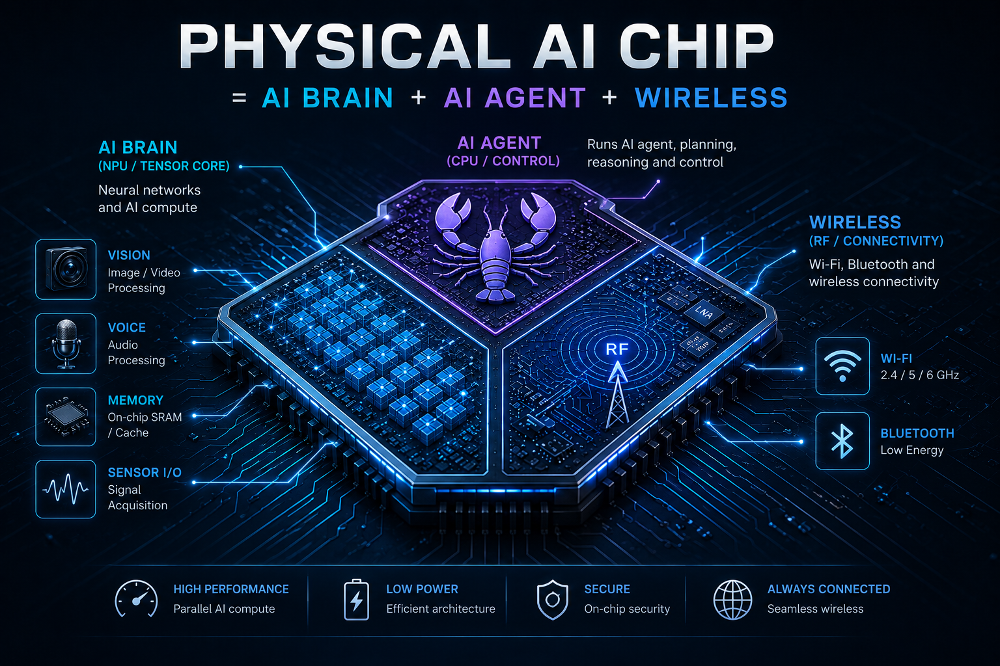
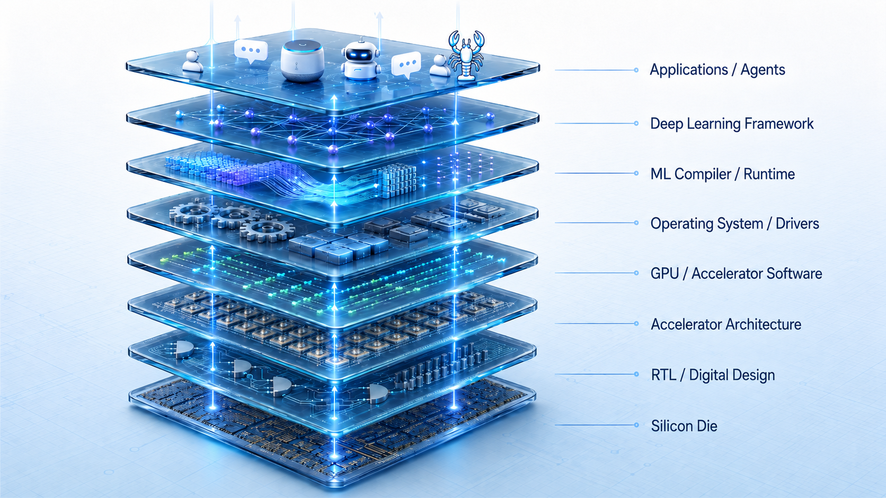

<div align="center" markdown="1">



[Star this repo](https://github.com/ai-hpc/ai-hardware-engineer-roadmap) · [Read the full roadmap online](https://ai-hpc.github.io/ai-hardware-engineer-roadmap/) · [ Join the Discord community](https://discord.gg/r8DKtDzrsm)

*Building the path from AI Hardware → Inference → Agents → Physical AI → AI Chips.*

</div>

---

## The Goal

> **Master AI inference, AI agent harness systems, and hardware engineering — then design a physical AI chip.**

The endpoint is a single die that runs production AI workloads, hosts a real agent runtime, and talks to the physical world over Wi-Fi/BLE/Thread — a Jetson-class AI brain fused with an ESP32-class wireless stack on one chip. Designing it takes three working skill sets at once: **inference engineering** (Qwen-class decode, kernels, quantization, rooflines, multi-GPU serving), **agent harness systems** (sessions, tools, multi-agent loops, RAG, evals, production observability), and **hardware engineering** (RTL, embedded Linux, Jetson, ESP32, RF, ASIC flow). This roadmap teaches all three side by side — the chip is the artifact, but the three pillars are the actual work.

---

## The Three Pillars

This roadmap is not three unrelated study tracks. It is a co-design loop. The
inference workload tells you what the silicon must accelerate, the agent
harness tells you what product behavior the runtime must support, and the
hardware platform tells you what power, memory, I/O, security, and manufacturing
constraints are real.

```
                               TARGET ARTIFACT
┌────────────────────────────────────────────────────────────────────────────┐
│                         Physical AI Agent Chip                             │
│ Linux-capable CPU + NPU/GPU/DLA + SRAM/DRAM fabric + ISP/audio/sensors     │
│ + Wi-Fi/BLE/Thread/Zigbee + secure boot/OTA + local agent runtime support  │
└────────────────────────────────────┬───────────────────────────────────────┘
                                     │
        ┌────────────────────────────┼────────────────────────────┐
        ▼                            ▼                            ▼
┌───────────────────────┐  ┌───────────────────────┐  ┌───────────────────────┐
│  AI Inference Systems │  │ Agent Harness Systems │  │ Physical HW Platform  │
├───────────────────────┤  ├───────────────────────┤  ├───────────────────────┤
│ Transformer execution │  │ Sessions and memory   │  │ Digital logic + RTL   │
│ GEMV/GEMM kernels     │  │ Tool/skill execution  │  │ CPU/NPU/GPU/DLA arch  │
│ Attention + KV cache  │  │ Gateway/RPC protocols │  │ SRAM/DRAM/DMA fabric  │
│ Quantization formats  │  │ Planner/executor loop │  │ MIPI CSI-2 + ISP      │
│ Tensor/pipeline para. │  │ Multi-agent control   │  │ Audio/GPIO/CAN/I2C    │
│ Serving schedulers    │  │ Evals and guardrails  │  │ Embedded Linux/L4T    │
│ CUDA/Triton kernels   │  │ Telemetry and tracing │  │ ESP32-class wireless  │
│ Roofline profiling    │  │ Product update path   │  │ FPGA -> ASIC flow     │
│ Real models: Qwen etc │  │ OpenClaw/SDKs/APIs    │  │ Board -> SoC thinking │
└───────────┬───────────┘  └───────────┬───────────┘  └───────────┬───────────┘
            │                          │                          │
            └──────────────┬───────────┴───────────┬──────────────┘
                           ▼                       ▼
        ┌────────────────────────────────────────────────────────────────┐
        │ Cross-layer contracts you learn to write                       │
        ├────────────────────────────────────────────────────────────────┤
        │ Workload contract: tokens/s, TTFT, context length, KV memory,  │
        │ batch shape, precision, latency tail, power budget.            │
        │ Runtime contract: APIs, cancellation, scheduling, security,    │
        │ observability, OTA, failure recovery, agent state persistence. │
        │ Hardware contract: MAC array, SRAM size, DMA plan, interconnect│
        │ bandwidth, radio wake events, camera/audio I/O, boot chain.    │
        └────────────────────────────────────────────────────────────────┘

                              CONVERGENCE PATH
┌────────────────────────────────────────────────────────────────────────────┐
│ Jetson-class AI subsystem        -> NPU/GPU/DLA/CPU compute tile           │
│ ESP32-class connectivity         -> Wi-Fi/BLE/Thread/Zigbee radio block    │
│ Camera, audio, and sensors       -> MIPI CSI-2, ISP, codecs, low-power I/O │
│ Agent runtime and serving stack  -> scheduler, memory manager, telemetry   │
│ FPGA/RTL/HLS/MLIR experiments    -> accelerator spec and tape-out target   │
└────────────────────────────────────────────────────────────────────────────┘
```

### 1. AI Inference Engineering
The workload your chip will run. This pillar teaches transformer execution from
the bottom up: tokenization, embeddings, QKV projection, RoPE, attention, MLP,
sampling, KV cache growth, quantization, batching, and serving. You learn why
decode is often memory-bandwidth bound, why prefill and decode behave
differently, and how GEMV/GEMM kernels, CUDA Graphs, FlashAttention, paged
attention, tensor parallelism, and roofline analysis change the system.

**Output of this pillar:** benchmark reports, kernel experiments, model-memory
budgets, quantization choices, and workload contracts precise enough to drive an
accelerator architecture.

### 2. AI Agent Harness Systems
The software stack that lives *above* your chip. This pillar covers agentic
runtimes, session models, gateway RPCs, tool calling, skills, multi-agent loops,
RAG, evals, observability, policy controls, and product update flows. A physical
AI chip does not just run matmuls. It runs user-facing loops with state,
timeouts, cancellations, tool failures, network events, sensor interrupts, and
safety constraints.

**Output of this pillar:** a production-style agent harness with clear runtime
interfaces, telemetry, evals, tool boundaries, scheduling requirements, and the
operational behavior your chip must support.

### 3. Physical Hardware Engineering
The substrate itself. This pillar starts with digital design, computer
architecture, C/C++ systems work, embedded Linux, Jetson Orin, custom carrier
boards, L4T, TensorRT/DLA, ESP32, OpenThread, Zigbee, ESP-Hosted, sensors,
camera bring-up, audio, power, thermal, compliance, and manufacturing. Then it
moves toward FPGA, HLS, MLIR/compiler work, RTL, SoC architecture, and AI chip
design.

**Output of this pillar:** working boards, bring-up logs, Linux images, wireless
integration, sensor pipelines, FPGA/RTL prototypes, and a credible chip spec
with compute, memory, I/O, security, and manufacturing constraints.

| Design question | Inference pillar answers | Agent pillar answers | Hardware pillar answers |
|---|---|---|---|
| How fast must the chip be? | TTFT, tok/s, batch shape, context length | User-visible latency, tool-loop timing | MACs, SRAM, DRAM bandwidth, clocks |
| How much memory is enough? | Weights, KV cache, activations, quantization | Session state, tool buffers, logs | SRAM, LPDDR, DMA, cache hierarchy |
| How does it talk to the world? | Streaming inference, multimodal inputs | Events, RPC, tools, wake-on-demand | Wi-Fi/BLE/Thread/Zigbee, MIPI, audio |
| How does it ship safely? | Reproducible benchmarks, model updates | Evals, policy, observability, rollback | Secure boot, OTA, compliance, test |

**Why the combination?** A chip without a runtime is a brick. A runtime without
an agent stack is a benchmark. An agent stack without inference cost discipline
is a demo. An inference accelerator that cannot talk to the physical world over
wireless, camera, audio, and sensor interfaces is a coprocessor someone else has
to integrate. The three pillars are how you build a chip that **ships in a real
physical product**: workload, runtime, radio, sensors, board, compiler, and
silicon aligned from the start.

---

## What You'll Have at the End

The reason for this roadmap, written as a checklist:

- [ ] You can take a transformer model, predict its decode tok/s on a given chip from first principles, and explain where it falls short of the roofline.
- [ ] You can hand-tune a CUDA/kernel path for a Qwen-class model — fused QKV, fused gate+up, CUDA Graphs, INT8 KV, speculative decoding — and quote a before/after benchmark.
- [ ] You can run a production agent harness end-to-end: gateway, sessions, skills, tool calls, multi-agent supervision, observability dashboards, the lot.
- [ ] You can take a Jetson module, design a carrier board for it, bring up custom L4T, flash it in volume, and ship a product against FCC/CE.
- [ ] You can bring up an ESP32 wireless coprocessor over SPI, expose it to a Linux host as a Wi-Fi/BLE/Thread/Zigbee radio, and integrate it into the same product.
- [ ] You can write RTL, drive timing closure on a real FPGA, and lower a small transformer block through HLS or a custom MLIR dialect.
- [ ] You can write the architecture spec for a **physical AI agent chip** — one die containing an NPU tile (Qwen-class decode at edge power), a wireless subsystem (Wi-Fi 6/BLE 5/Thread/Zigbee), MIPI CSI-2 camera input, ISP, audio I/O, and a Linux-capable CPU — with realistic numbers for tile size, SRAM budget, MAC array, DMA, RF integration, and compiler/runtime interface.

That last bullet is the goal. The first six exist to make it real.

---

## Who This Is For

- **AI/ML engineers** who want to stop treating inference as a black box and design the chip that runs it.
- **Inference engineers** who want to extend up into agent-runtime co-design and down into kernel + silicon.
- **Embedded/firmware engineers** who want to climb the stack — from boards to runtimes to chip architecture.
- **Hardware/RTL/FPGA engineers** who need workload and runtime intuition before specing accelerators.
- **CS students** who want a structured path that ends at "I designed a chip" rather than "I read about chips."

If you only want to call an LLM API, this isn't for you. If you want to design the silicon that calls it, keep reading.

---

## The AI Chip Stack

Everything in this roadmap maps onto an 8-layer stack. The point isn't to memorize layers — it's to understand how decisions in one layer ripple through the others.



When you're designing a chip, **every** layer is a constraint and a degree of freedom. The roadmap teaches you to read the whole column.

---

## The Path

Five phases. The first four are foundation; the fifth is where the three pillars converge.

### [Phase 1 — Digital Foundations](Phase%201%20-%20Foundational%20Knowledge/Guide.md) *(Hardware pillar)*
*The language of hardware. Logic gates → GPU code.*

| Module | What you'll learn |
|--------|------------------|
| [Digital Design & HDL](Phase%201%20-%20Foundational%20Knowledge/1.%20Digital%20Design%20and%20Hardware%20Description%20Languages/Guide.md) | Verilog/SystemVerilog, simulation, the language you'll later write your accelerator in |
| [Computer Architecture](Phase%201%20-%20Foundational%20Knowledge/2.%20Computer%20Architecture%20and%20Hardware/Guide.md) | CPUs, GPUs, caches, memory hierarchies — the mental model behind your chip |
| [Operating Systems](Phase%201%20-%20Foundational%20Knowledge/3.%20Operating%20Systems/Guide.md) | Processes, drivers, scheduling — what your chip's host actually does |
| [C++ & Parallel Computing](Phase%201%20-%20Foundational%20Knowledge/4.%20C%2B%2B%20and%20Parallel%20Computing/Guide.md) | SIMD, OpenMP, **CUDA**, ROCm, OpenCL/SYCL |

### [Phase 2 — Embedded Systems](Phase%202%20-%20Embedded%20Systems/Guide.md) *(Hardware pillar)*
*Get hands-on with real hardware. MCUs, sensors, embedded Linux.*

| Module | What you'll learn |
|--------|------------------|
| [Schematic & PCB Design](Phase%202%20-%20Embedded%20Systems/1.%20Schematic%20Capture%20and%20PCB%20Design/Guide.md) | Read schematics, design carrier boards |
| [Embedded Software](Phase%202%20-%20Embedded%20Systems/2.%20Embedded%20Software/Guide.md) | Cortex-M, FreeRTOS, SPI/I²C/CAN, IoT (OpenThread, Zigbee) |
| [Embedded Linux](Phase%202%20-%20Embedded%20Systems/3.%20Embedded%20Linux/Guide.md) | Yocto, PetaLinux, driver bring-up |
| [Product Design](Phase%202%20-%20Embedded%20Systems/4.%20Product%20Design/Guide.md) | Going from prototype to shippable product |

### [Phase 3 — AI Workloads](Phase%203%20-%20Artificial%20Intelligence/Guide.md) *(Inference & Agent pillars start here)*
*Understand the workloads your chip must serve. Core + two tracks.*

**Core (everyone):**
- [Neural Networks](Phase%203%20-%20Artificial%20Intelligence/1.%20Neural%20Networks/Guide.md) — backprop, CNNs, transformers from first principles
- [**Transformer Fundamentals**](Phase%203%20-%20Artificial%20Intelligence/1.%20Neural%20Networks/Transformer%20Fundamentals/Lecture-01.md) — the prerequisite for every inference lecture downstream
- [Deep Learning Frameworks](Phase%203%20-%20Artificial%20Intelligence/2.%20Deep%20Learning%20Frameworks/Guide.md) — micrograd → PyTorch → tinygrad

**Track A — Hardware & Edge AI:** Computer vision, sensor fusion, Voice AI, Edge AI & optimization. Feeds Phase 4B and Phase 5C.

**Track B — Agentic AI & ML Engineering:** [42 lectures](Phase%203%20-%20Artificial%20Intelligence/Track%20B%20-%20Agentic%20AI%20and%20ML%20Engineering/3.%20Agentic%20AI%20and%20GenAI/Lectures/README.md) on agent harnesses, LangGraph, multi-agent systems, RAG, evaluation, production runtime discipline, OpenClaw, OpenAI Agents SDK, security, plus a [Qwen3.5-4B-Base Unsloth fine-tuning course](Phase%203%20-%20Artificial%20Intelligence/Track%20B%20-%20Agentic%20AI%20and%20ML%20Engineering/5.%20LLM%20Application%20Development/Qwen3.5-4B%20Unsloth%20Fine-Tuning/Guide.md). This is the **agent harness pillar in its primary form** — read in order if your destination is the chip + runtime + harness story.

### Phase 4 — Deployment & Compilation *(All three pillars co-exist here)*
*Take AI to real silicon. Three specialized tracks.*

| Track | Focus | Pillar |
|-------|-------|--------|
| [**A — Xilinx FPGA**](Phase%204%20-%20Track%20A%20-%20Xilinx%20FPGA/1.%20Xilinx%20FPGA%20Development/Guide.md) | Vivado, Zynq MPSoC, HLS, driver dev, video pipeline | Hardware |
| [**B — NVIDIA Jetson**](Phase%204%20-%20Track%20B%20-%20Nvidia%20Jetson/1.%20Nvidia%20Jetson%20Platform/Guide.md) | Orin platform, custom carrier, L4T, OTA, TensorRT/DLA | Hardware + Inference |
| [**C — ML Compiler**](Phase%204%20-%20Track%20C%20-%20ML%20Compiler%20and%20Graph%20Optimization/Guide.md) | MLIR, TVM, Triton, kernel engineering, quantization | Inference |

You don't have to do all three. But to land at chip design, you want enough of **A** to write RTL, enough of **B** to know what an inference platform looks like, and enough of **C** to know how a compiler will target your chip.

### [Phase 5 — Specialization & Convergence](Phase%205%20-%20Advanced%20Topics%20and%20Specialization/Guide.md)
*The three pillars converge here. Specialization tracks plus the chip-design endpoint.*

| Track | What you'll specialize in | Pillar(s) |
|-------|---------------------------|-----------|
| [**A — GPU Infrastructure**](Phase%205%20-%20Advanced%20Topics%20and%20Specialization/1.%20GPU%20Infrastructure/Guide.md) | Multi-GPU, NVLink, NCCL, AMD ROCm/HIP, MI300X | Inference |
| [**B — HPC (CUDA-X)**](Phase%205%20-%20Advanced%20Topics%20and%20Specialization/2.%20High%20Performance%20Computing/Guide.md) | cuBLAS, cuDNN, NVSHMEM, 40+ libraries | Inference |
| [**C — Edge AI**](Phase%205%20-%20Advanced%20Topics%20and%20Specialization/3.%20Edge%20AI/Guide.md) | Holoscan, [Edge LLM Inference Internals](Phase%205%20-%20Advanced%20Topics%20and%20Specialization/3.%20Edge%20AI/Edge%20LLM%20Inference%20Internals/Lecture-01.md), [**Qwen Inference Optimization (6-lecture series)**](Phase%205%20-%20Advanced%20Topics%20and%20Specialization/3.%20Edge%20AI/Qwen%20Inference%20Optimization/README.md), AI-driven wireless | Inference |
| [**D — Robotics**](Phase%205%20-%20Advanced%20Topics%20and%20Specialization/4.%20Robotics/Guide.md) | ROS 2, Nav2, motion planning, swarm | Hardware + Inference |
| [**E — Autonomous Vehicles**](Phase%205%20-%20Advanced%20Topics%20and%20Specialization/5.%20Autonomous%20Vehicles/Guide.md) | openpilot, BEV perception, ISO 26262, TRACE32 debug | Hardware + Inference |
| [**F — AI Chip Design**](Phase%205%20-%20Advanced%20Topics%20and%20Specialization/6.%20AI%20Chip%20Design/Guide.md) | **The endpoint.** Systolic arrays, dataflow architectures, tinygrad↔hardware, RISC-V AI accelerator design, ASIC flow — and the integration question: how do you put an NPU, an ESP32-class radio, an ISP, and a Linux CPU on one die? | **All three** |
| [**G — ML Systems Engineering**](Phase%205%20-%20Advanced%20Topics%20and%20Specialization/7.%20ML%20Systems%20Engineering/Guide.md) | Training systems, inference runtimes, GPU scheduling, distributed serving, compiler/runtime work, observability | Inference + Infrastructure |

**The signature path:** Phase 1 → Phase 2 → Phase 3 (Core + Track B) → Phase 4 (selected) → Phase 5C + Phase 5F.

**The MLSys path:** Phase 1 §3/§4 → Phase 3 Core → Phase 4B/4C → Phase 5A/B/C → Phase 5G.

---

## Featured Inference Lectures

The deepest, most current technical content lives in these Phase 5 lectures — read them as a single arc:

| # | Lecture | What it teaches |
|---|---------|-----------------|
| 1 | [Edge LLM Inference Internals](Phase%205%20-%20Advanced%20Topics%20and%20Specialization/3.%20Edge%20AI/Edge%20LLM%20Inference%20Internals/Lecture-01.md) | GEMV vs GEMM rooflines, K-quants, KV-cache math, Jetson `nvpmodel`/`jetson_clocks` diagnostics |
| 2 | [Qwen Architecture Deep Dive](Phase%205%20-%20Advanced%20Topics%20and%20Specialization/3.%20Edge%20AI/Qwen%20Inference%20Optimization/Lecture-01.md) | Qwen3-4B and Qwen2.5-72B side by side, GQA, RoPE-NeoX, SwiGLU, full `config.json` → tensor-shape derivation |
| 3 | [Quantizing Qwen3-4B to Q4](Phase%205%20-%20Advanced%20Topics%20and%20Specialization/3.%20Edge%20AI/Qwen%20Inference%20Optimization/Lecture-02.md) | Q4_K_M vs AWQ vs GPTQ, why V and FFN-down get upgraded, calibration, GGUF layout |
| 4 | [Decode Optimization on Jetson](Phase%205%20-%20Advanced%20Topics%20and%20Specialization/3.%20Edge%20AI/Qwen%20Inference%20Optimization/Lecture-03.md) | 0.2 → 30 tok/s ladder, fused QKV/gate-up, CUDA Graphs, INT8 KV, speculative decoding |
| 5 | [Qwen2.5-72B Multi-GPU FP16](Phase%205%20-%20Advanced%20Topics%20and%20Specialization/3.%20Edge%20AI/Qwen%20Inference%20Optimization/Lecture-04.md) | TP=8 partitioning, NCCL hot path, paged attention, YaRN, runtime recipes |
| 6 | [Cross-Model & Production Serving](Phase%205%20-%20Advanced%20Topics%20and%20Specialization/3.%20Edge%20AI/Qwen%20Inference%20Optimization/Lecture-05.md) | Speculative decoding pairings, edge/cloud routing, observability, capacity planning |
| 7 | [Batched GEMM vs Normal GEMM](Phase%205%20-%20Advanced%20Topics%20and%20Specialization/3.%20Edge%20AI/Qwen%20Inference%20Optimization/Lecture-06.md) | cuBLAS API forms, column-major dance, tensor cores, bit-exact reproducibility |
| 8 | [AI-Driven Wireless Communication](Phase%205%20-%20Advanced%20Topics%20and%20Specialization/3.%20Edge%20AI/AI-Driven%20Wireless%20Communication/Lecture-01.md) | Neural PHY, O-RAN xApps, SDR + DL, modem NPU silicon |

Read them in order if you're new. Skip to whichever solves your current problem if you're not.

---

## How to Use This Roadmap

Don't read this like a book. Treat it like a **build-and-measure curriculum**.

For every block:

1. Read the theory.
2. Build the subsystem or implement the technique.
3. Measure something — latency, throughput, occupancy, bandwidth, power, accuracy, area, perplexity.
4. Ship one reusable artifact (benchmark, kernel, board, dashboard, RTL block, eval report).

Each artifact is a brick in the chip you're going to design.

Before you start, decide three things:

1. **Where you're entering the stack.** (See "Who This Is For" above.)
2. **What hardware you can actually use.** Jetson Orin Nano is the cheapest end-to-end inference target; an RTX or rented L40S/H100 covers most of the datacenter path; a Xilinx Zynq dev board covers FPGA; an ESP32 + sensor breakout covers embedded.
3. **How you'll track outputs.** A notebook, a benchmarks repo, a project log — any system you actually use.

---

## Course Quality Bar

Every serious module in this roadmap should end with evidence, not vibes.

Use this standard for each course block:

| Step | What to do | Evidence |
|------|------------|----------|
| Understand | Learn the concept and why it matters in the stack | short design note or diagram |
| Build | Implement the subsystem, kernel, model path, driver, board flow, or runtime feature | code, RTL, config, schematic, or build script |
| Measure | Collect real numbers | latency, throughput, memory, power, timing, utilization, accuracy, area, or boot time |
| Debug | Explain at least one failure mode | log, waveform, profiler trace, ILA capture, or root-cause note |
| Ship | Package the work for review | README, commands, raw results, and final report |

Weak completion:

```text
I read about CUDA, TensorRT, and FPGAs.
```

Strong completion:

```text
I built a TensorRT INT8 benchmark on Orin Nano, captured latency/RAM/power,
compared it to FP16, and explained why one layer stayed memory-bound.
```

The roadmap is intentionally broad, but the completion standard is narrow: build something real, measure it, and explain the tradeoff.

---

## Reference Projects

These projects exist for you to study, not just read about:

| Project | Why it's here |
|---------|---------------|
| [**jetson-llm-runtime**](Projects/jetson-llm-runtime/README.md) &nbsp;·&nbsp; [`GeniePod/genie-ai-runtime` v1.0.0](https://github.com/GeniePod/genie-ai-runtime) | Custom Jetson LLM inference runtime — every GEMV/GEMM kernel, KV cache, paged-attention path, build flow. The scaffold in this folder graduated into the production runtime at `GeniePod/genie-ai-runtime`: 38 tok/s prefill, +115 % vs `llama-bench` on Orin Nano Super 8 GB, tensor-core MMQ, persistent KV, INT8 KV default, OpenAI-shape HTTP server. The inference pillar in code. |
| [**jetson-esp-hosted**](https://github.com/ai-hpc/jetson-esp-hosted) | Jetson-validated ESP-Hosted fork for SPI/Wi-Fi/BLE bring-up. The embedded pillar in code. |
| [**tinygrad**](https://github.com/tinygrad/tinygrad) | ~10 K-line ML framework. The cleanest place to read framework → compiler → kernel → backend in one repo. |
| [**openpilot**](https://github.com/commaai/openpilot) | Production ADAS stack. End-to-end perception, ML, and embedded software on one board. |

---

## Target Roles This Enables

The roadmap is full-stack on purpose, but it produces several well-paid specialist roles along the way:

| Role | Key Phases |
|------|-----------|
| **AI Inference Engineer** | 3 + 4C + 5A/B/C |
| **ML Systems Engineer** | 1 + 3 + 4B/4C + 5A/B/C/G |
| **AI Compiler Engineer** | 1 + 4C + 5B |
| **Edge AI Engineer** | 3A + 4B + 5C |
| **GPU Runtime / Kernel Engineer** | 1 + 4B + 5A |
| **Agentic AI / Agent Harness Engineer** | 3B (full lecture series) + 5C |
| **Embedded / Firmware Engineer** | 1 + 2 + 4B |
| **Autonomous Vehicles Engineer** | 3A + 4B + 5E |
| **RTL / FPGA Design Engineer** | 1 + 4A |
| **AI Accelerator Architect** | 1 + 4A + 5F |
| **Physical AI Chip Architect** | Full path — Jetson + ESP32 fused into one SoC; the chip-design endpoint |

→ See [**Roles & Market Analysis**](Roles%20and%20Market%20Analysis.md) for salary data, 23 sub-roles, remote percentages, and hiring signals.

---

## Why This Roadmap Exists

A **physical AI chip** — Jetson-class brain + ESP32-class radio + sensors + Linux on one die — is one of the most demanding engineering projects a small team can attempt. It needs:

- **Workload truth.** You can't design an NPU tile or a memory hierarchy without knowing what bytes-per-token a Qwen-class decode will throw at you. That's the inference pillar.
- **System truth.** Your chip is going to host runtimes that host agent harnesses in a battery-powered product. Wrong access pattern (batch=1 chat vs always-on wake word vs long-context retrieval), wrong wake-on-radio policy, wrong boot ROM, you've shipped the wrong chip. That's the agent harness pillar.
- **Engineering truth — both halves.** Silicon doesn't care about your intentions. RTL, timing, power, embedded software, board, antenna, FCC, manufacturing — there's no shortcut. You need the AI-compute side (Jetson stack) *and* the wireless side (ESP32 stack) on the same die *and* on the same Linux. That's the hardware pillar.

Most people learn one pillar. Some learn two. This roadmap is for the people who want to learn all three, and then build the thing that puts an AI agent in a real product — talking to sensors, talking to networks, talking to humans, off a single SoC.

---

<div align="center" markdown="1">

**Build the workload. Build the runtime. Build the radio. Build the silicon. Ship the physical AI chip.**

[⭐ Star this repo](https://github.com/ai-hpc/ai-hardware-engineer-roadmap) if you're on this path — it helps the next engineer find it.

</div>

---

## Star History

<a href="https://www.star-history.com/#ai-hpc/ai-hardware-engineer-roadmap&Date">
  <picture>
    <source media="(prefers-color-scheme: dark)" srcset="https://api.star-history.com/svg?repos=ai-hpc/ai-hardware-engineer-roadmap&type=Date&theme=dark" />
    <source media="(prefers-color-scheme: light)" srcset="https://api.star-history.com/svg?repos=ai-hpc/ai-hardware-engineer-roadmap&type=Date" />
    
  </picture>
</a>
